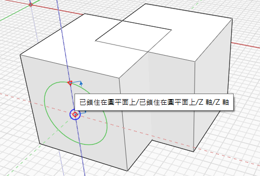

# 圓 

## 繪製圓

使用「圓」工具在空間中或其他物件上繪製圓。

鍵盤快速鍵：C

若要繪製圓，請先選擇中心點，然後指定圓的半徑。接下來，圓會自動變成面。

## 編輯圓

您也可以在放置的圓上按一下右鍵，然後選擇底部的「編輯圓」來修改圓：

<figure><figcaption></figcaption></figure>

此時會顯示「編輯圓」掣點，讓您變更圓的大小或方位。編輯時，新圓將以輪廓顯示。

您會看到一些掣點出現：

* 中心掣點控制圓的原點
* 沿邊的掣點控制圓的半徑
* 頂部的掣點控制圓的法線/方位

<figure><figcaption></figcaption></figure>

若要完成編輯，請按一下空白空間或按 Esc 結束工具。新圓將取代目前的圓。
