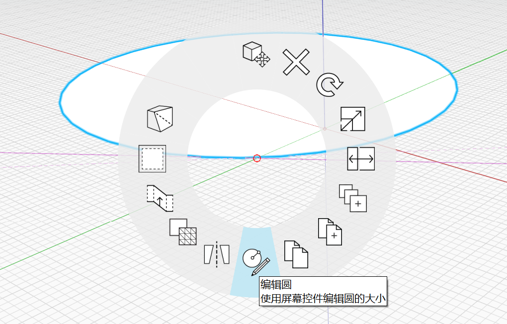

# Cercle 

## Dessiner un cercle

Utilisez l’outil Cercle pour dessiner un cercle dans l’espace ou sur un autre objet.

Raccourci clavier : C

Pour dessiner un cercle, sélectionnez d’abord·le point central, puis indiquez le rayon du cercle. Le cercle devient ensuite automatiquement une face.

## Modifier un cercle

Vous pouvez également modifier un cercle que vous avez déjà placé en cliquant dessus avec le bouton droit de la souris et en choisissant Modifier le cercle dans la partie inférieure :

<figure><figcaption></figcaption></figure>

Les poignées de modification de cercle s’affichent, vous permettant de modifier les dimensions ou l’orientation du cercle. Le nouveau cercle s’affiche sous forme de contour lorsque vous le modifiez.

Quelques poignées s’afficheront :

* La poignée centrale détermine l’origine du cercle
* La poignée qui s’affiche le long de l’arête détermine le rayon du cercle
* La poignée située en haut détermine la normale/l’orientation du cercle

<figure><figcaption></figcaption></figure>

Pour terminer la modification, quittez l’outil en cliquant dans un espace vide ou en appuyant sur la touche Échap. Le nouveau cercle remplacera le cercle actuel.
