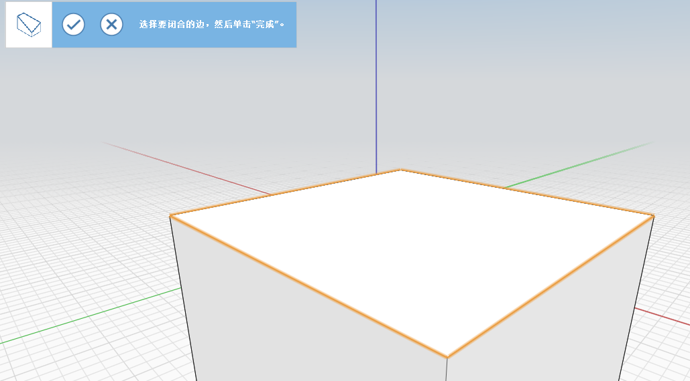
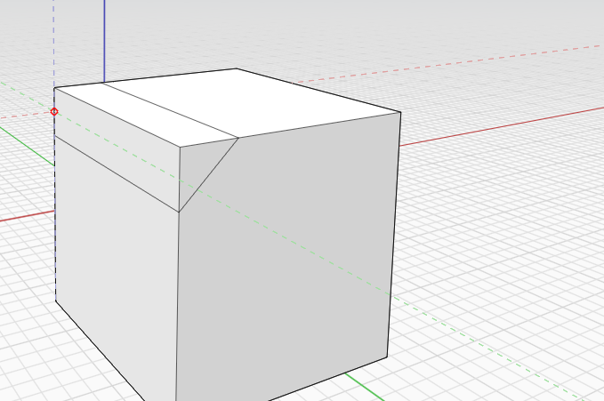
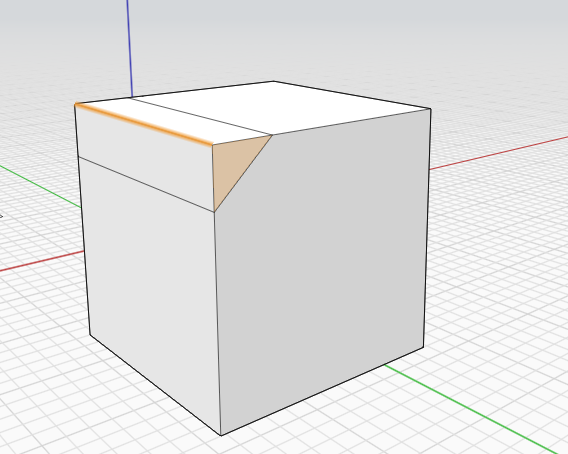
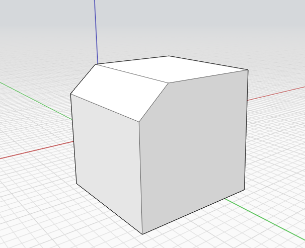
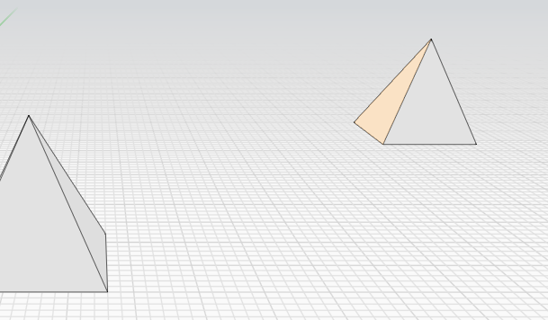
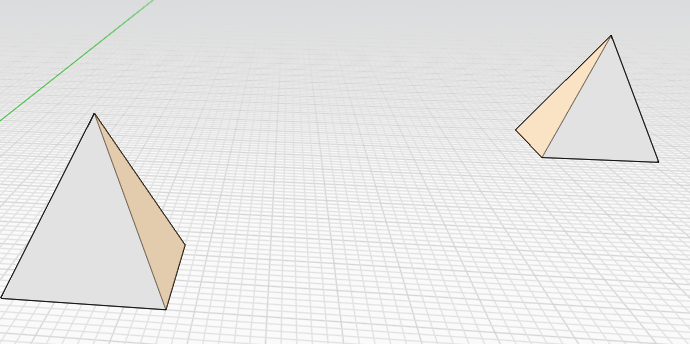
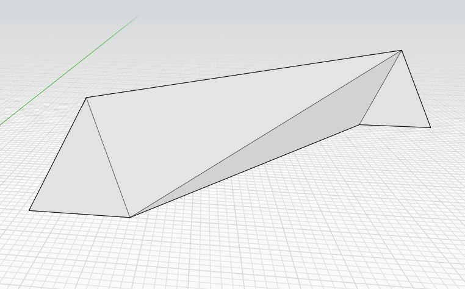

# Copertura, Estrusione su percorso, Loft

È possibile racchiudere i bordi aperti, apportare modifiche alla geometria lungo un percorso di bordi e collegare più profili o bordi.

## Per chiudere una serie di superfici

1. Dal menu **Strumenti di geometria avanzati** sulla barra delle azioni, fare clic sullo strumento **Copertura**. .png>)
2.  Fare clic sui bordi dell'oggetto che si desidera coprire.

    

    1.  Fare clic su **Fine**.

        

## Per eseguire l'estrusione su percorso della geometria lungo una traiettoria

1. Utilizzare una linea per contrassegnare la superficie di un oggetto che si desidera tagliare. 
2. Fare clic sull'icona dello strumento Estrusione su percorso. .png>)
3.  Selezionare la superficie contrassegnata in precedenza.

    ```
      
    ```

    1.  Selezionare il bordo che si desidera tagliare.

        
    2. Fare clic sull'icona **Fine**. L'oggetto originale viene modificato lungo la traiettoria dell'estrusione su percorso. \ (1) (1).png>)

## Per eseguire il loft di più profili o bordi

1. Dal menu **Strumenti di geometria avanzati** sulla barra delle azioni, fare clic sullo strumento **Loft**. .png>)
2.  Selezionare la superficie o i bordi di cui si desidera eseguire il loft nel primo oggetto.

    
3.  Selezionare la superficie o i bordi di cui si desidera eseguire il loft nel secondo oggetto. Ripetere questo passaggio per altri oggetti.

    
4.  Fare clic sull'icona **Fine**.  (1) (2) (1).png>)

    
