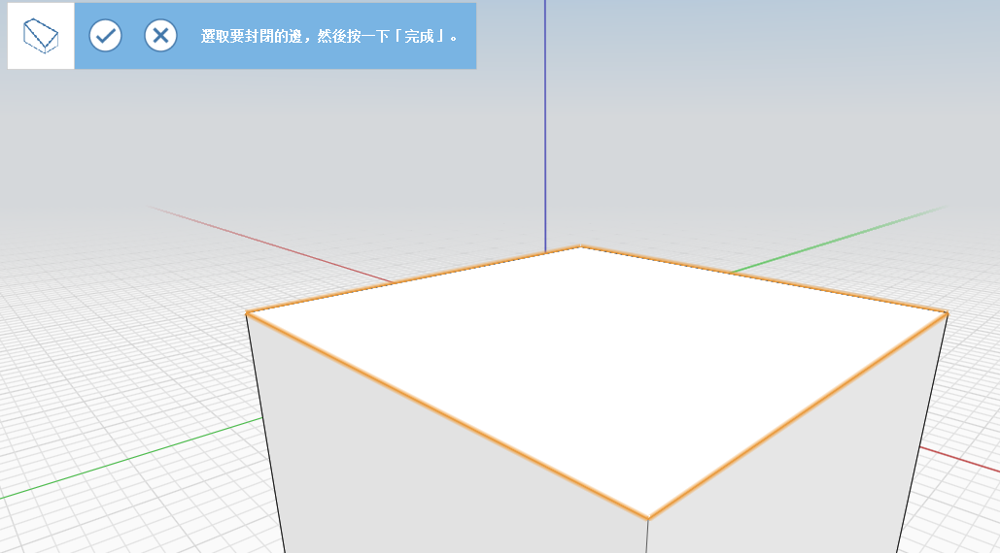

# Nástroje Pokrýt, Tažení, Šablonování

Uzavírejte otevřené hrany, provádějte změny geometrie podél trajektorie hran a propojujte více profilů nebo hran.

## Uzavření řady ploch

1. V nabídce **Pokročilé nástroje geometrie** na panelu Akce klikněte na nástroj **Pokrýt**. \.png>)
2.  Klikněte na hrany objektu, který chcete pokrýt.

    

    1.  Klikněte na tlačítko **Dokončit**.

        

## Tažení geometrie podél trajektorie

1. Pomocí čáry označte plochu objektu, který chcete oříznout. 
2. Klikněte na ikonu nástroje tažení. \.png>)
3.  Vyberte plochu, kterou jste označili dříve.

    ```
      
    ```

    1.  Vyberte hranu, kterou chcete oříznout.

        
    2. Klikněte na ikonu **Dokončit**. Původní objekt je upraven podél trajektorie tažení. \ (1) (1).png>)

## Šablonování více profilů nebo hran

1. V nabídce **Pokročilé nástroje geometrie** na panelu Akce klikněte na nástroj **Šablonování**. \.png>)
2.  Na prvním objektu vyberte plochu nebo hrany, u kterých chcete provést šablonování.

    
3.  Na druhém objektu vyberte plochu nebo hrany, u kterých chcete provést šablonování. Tento krok opakujte pro další objekty.

    
4.  Klikněte na ikonu **Dokončit**. \ (1) (2) (1).png>)

    
