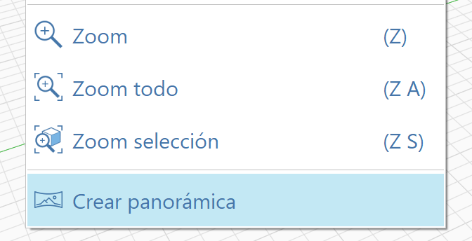
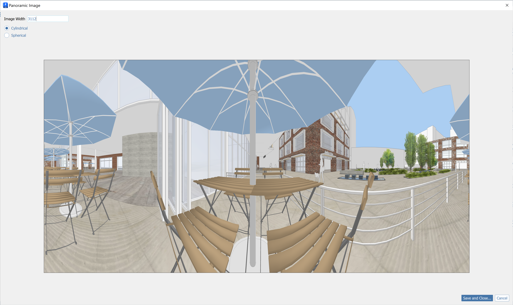

# Create Panorama

In addition to the In Sketch view camera options available, FormIt can export a Panorama image for 3D viewing of your sketch in an external viewer, available from the View menu:

<figure><figcaption></figcaption></figure>

This will generate a full 360-degree image from the current camera view. &#x20;

The width of the image can be modified and the mode can be toggled between Cylindrical and Spherical panorama:

<figure><figcaption></figcaption></figure>

Save the file, and load it in your favorite 3D viewer, such as [https://renderstuff.com/tools/360-panorama-web-viewer/](https://renderstuff.com/tools/360-panorama-web-viewer/) (used in these examples):

<figure><figcaption></figcaption></figure>

This is a also a great tool for viewing indoor spaces:

<figure><figcaption></figcaption></figure>

<figure><figcaption></figcaption></figure>
