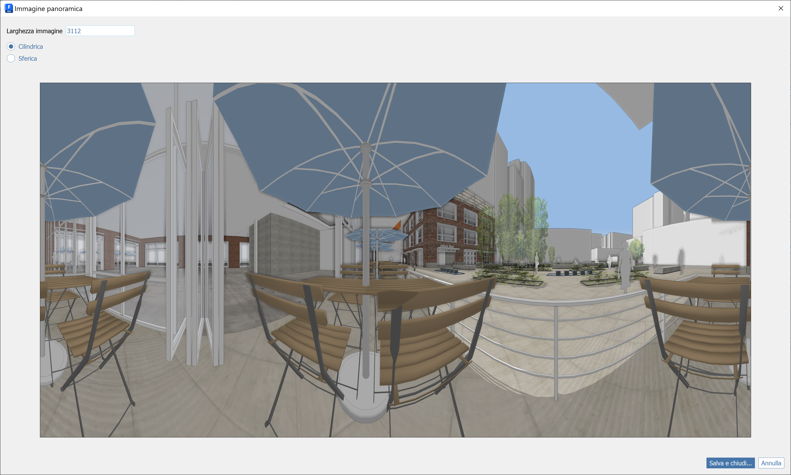

# Příkaz Vytvořit panorama

Kromě dostupných možností kamery v náčrtu může aplikace FormIt exportovat panoramatický obrázek pro 3D zobrazení náčrtu v externím prohlížeči. Příslušný příkaz je k dispozici v nabídce Pohled:

<figure><figcaption></figcaption></figure>

Tento příkaz vygeneruje z aktuálního pohledu kamery úplný 360stupňový obrázek.  

Šířku obrázku lze upravit a režim lze přepínat mezi válcovým a kulovým panoramatem:

<figure><figcaption></figcaption></figure>

Uložte soubor a načtěte jej do svého oblíbeného 3D prohlížeče, například [https://renderstuff.com/tools/360-panorama-web-viewer/](https://renderstuff.com/tools/360-panorama-web-viewer/) (tento prohlížeč je použit v těchto příkladech):

<figure><figcaption></figcaption></figure>

Jedná se také o skvělý nástroj pro prohlížení vnitřních prostorů:

<figure><figcaption></figcaption></figure>

<figure><figcaption></figcaption></figure>
