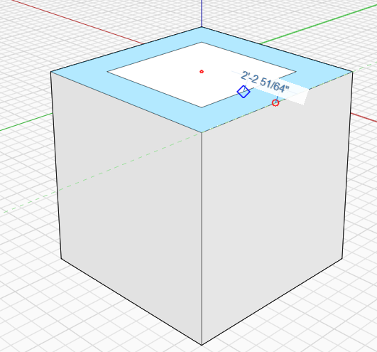

# Faces : extrusion, coupe et décalage

Poussez ou tirez une face, imprimez de nouvelles formes sur des formes existantes ou créez des arêtes décalées.

## Extrusion

Pour déplacer une face, cliquez dessus une fois pour la sélectionner, puis cliquez et faites glisser le curseur. La face se déplace d’avant en arrière. Vous pouvez désormais déplacer la souris pour accrocher et déduire d’autres éléments du modèle. Cliquez à nouveau pour terminer le déplacement de la face. Maintenez la touche Ctrl enfoncée pour conserver les arêtes d’origine.

.png>)

## Graver

Pour graver des formes, utilisez un outil d’esquisse 3D pour tracer des lignes, des arcs, des splines, des rectangles ou des cercles sur des faces existantes. Cette action crée de nouvelles faces qui peuvent être déplacées indépendamment de la face d’origine.

\

## Décalage

Pour décaler la face d’un objet, procédez comme suit :

1. Tout d’abord, sélectionnez la face que vous souhaitez modifier, puis cliquez avec le bouton droit de la souris pour afficher le menu **contextuel**.&#x20;
2. Dans le menu **contextuel**, cliquez sur l’outil **Décaler la face**.&#x20;
3. Déplacez le curseur sur la face sélectionnée et ajustez les lignes qui s’affichent jusqu’à ce que vous atteigniez l’effet de décalage souhaité.
4. Cliquez n’importe où pour terminer le décalage. Vous pouvez maintenant déplacer indépendamment la face décalée.

\
\

