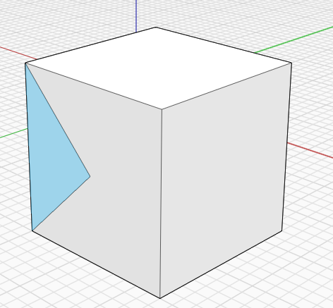
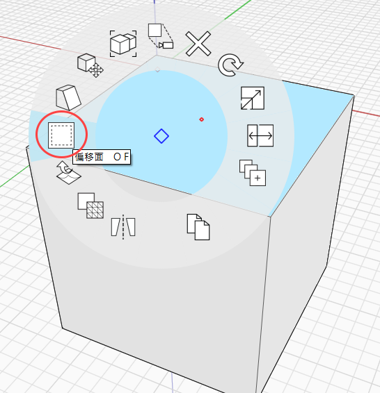

# Powierzchnie: wyciąganie, wycinanie i odsuwanie

Wypchnij lub pociągnij powierzchnię, odciśnij nowe kształty na istniejących lub utwórz nowe odsunięte krawędzie.

## Wyciąganie

Aby wypchnąć lub pociągnąć powierzchnię, wybierz ją jednym kliknięciem, a następnie kliknij i przeciągnij. Powierzchnia będzie przesuwana w przód i w tył. Teraz za pomocą myszy możesz przyciągać ją i korzystać z wnioskowania względem innych elementów modelu. Kliknij ponownie, aby zakończyć przesuwanie powierzchni. Przytrzymaj naciśnięty klawisz CTRL, aby zachować oryginalne krawędzie.

.png>)

## Odciskanie

Aby odcisnąć kształty, za pomocą narzędzia Szkic 3D narysuj linie, łuki, splajny, prostokąty lub okręgi na istniejących powierzchniach. Ta operacja spowoduje utworzenie nowych powierzchni, które można wypychać lub ciągnąć niezależnie od oryginalnej powierzchni.

\

## Odsunięcie

Odsuwanie powierzchni obiektu:

1. Najpierw wybierz powierzchnię, którą chcesz edytować, a następnie kliknij prawym przyciskiem myszy, aby wyświetlić **menu kontekstowe**.&#x20;
2. W **menu kontekstowym** kliknij narzędzie **Odsuń powierzchnię**.&#x20;
3. Przesuwaj kursor nad wybraną powierzchnią i dopasowuj wyświetlane linie, aż osiągniesz żądany efekt odsunięcia.
4. Kliknij w dowolnym miejscu, aby zakończyć odsunięcie. Teraz możesz niezależnie wypychać lub ciągnąć odsuniętą powierzchnię.

\
\

