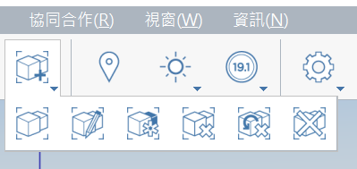

# Grupy

Jedną z najbardziej podstawowych, ale jednocześnie ważnych technik w procesach roboczych programu FormIt jest grupowanie. Grupy zapobiegają łączeniu się geometrii i umożliwiają konfigurowanie relacji nadrzędności/podrzędności między skopiowanymi elementami, tak aby zaktualizowanie jednego elementu powodowało zaktualizowanie obu. Więcej informacji na temat grup zamieszczono [tutaj](../formit-primer/part-i/grouping-objects.md).

Grupy można tworzyć i edytować na dwa sposoby: z poziomu menu kontekstowego wybranej grupy lub z poziomu głównego paska narzędzi.

## Interakcje grup

Aby **utworzyć grupę**, wybierz elementy, które chcesz zgrupować — mogą to być krawędzie, powierzchnie, bryły lub inne grupy — i kliknij prawym przyciskiem myszy. Z menu kontekstowego wybierz narzędzie **Grupuj (G)**. Nie można grupować obrazów zaimportowanych i satelitarnych.

Aby **wybrać grupę**, kliknij ją raz. Zwróć uwagę na przerywane linie widoczne podczas wybierania grupy — wskazują one całkowity rozmiar grupy.

Aby **edytować grupę**, kliknij ją dwukrotnie. Spowoduje to uruchomienie trybu edycji, w którym elementy spoza bieżącej grupy można jedynie wyświetlać i przyciągać, ale nie można ich wybierać. Możesz również ukryć elementy spoza bieżącej grupy, używając skrótu klawiaturowego **H**.

Istnieje możliwość tworzenia **grup w grupach:** grupy te, nazywane **grupami zagnieżdżonymi**, można tworzyć w trybie edycji grupy. Aby przejść o jeden poziom w górę w grupach zagnieżdżonych, kliknij w dowolnym miejscu poza grupami.

Aby **wyjść z trybu edycji grupy**, kliknij dwukrotnie w dowolnym miejscu poza grupą.

Możesz **skopiować grupę**, aby utworzyć relację między oryginalną grupą a jej kopią: w przypadku edycji jakichkolwiek skopiowanych grup te same zmiany będą miały wpływ na wszystkie powiązane grupy.

Aby **rozłączyć relację między skopiowanymi grupami**, wybierz grupę lub grupy, które chcesz oddzielić, kliknij prawym przyciskiem myszy i z menu kontekstowego wybierz opcję **Ustaw jako niepowtarzalne**. Opcję Ustaw jako niepowtarzalne możesz również wybrać z paska narzędzi Grupy.

Aby **wybrać wszystkie powiązane grupy**, ustaw kursor na grupie i naciśnij klawisz Tab. Gdy wszystkie powiązane grupy zostaną wyróżnione, kliknij te grupy, aby je wybrać. Możesz wówczas wykonać operację na wszystkich grupach jednocześnie.

[**Drzewo grup**](groups-tree.md) to jedno miejsce, w którym możesz wyświetlić wszystkie grupy w projekcie i zarządzać nimi.

## Menu kontekstowe Grupy i dostęp do paska narzędzi

## 

**Grupuj elementy**

Aby utworzyć grupę z elementu paska narzędzi Grupy, wybierz co najmniej jeden element, wybierz ikonę **Utwórz grupę**, a następnie wybierz ikonę **Zakończ**. Możesz również wybrać opcję **Utwórz grupę** z elementu paska narzędzi Grupy, a następnie wybrać elementy, które chcesz zgrupować, i wybrać ikonę **Zakończ**.

Aby **edytować grupę z poziomu elementu paska narzędzi Grupy**, wybierz ikonę **Edytuj grupę**, a następnie kliknij grupę, którą chcesz edytować. Po zakończeniu wprowadzania zmian wybierz ikonę **Zakończ**. To narzędzie umożliwia wybranie określonej grupy, która ma być edytowana, nawet jeśli jest głęboko zagnieżdżona.

**Aby grupa była unikatowa na pasku narzędzi**, wybierz ikonę **Ustaw jako niepowtarzalne** na pasku narzędzi Grupy. Ponadto możesz wybrać opcję **Ustaw jako niepowtarzalne** z elementu paska narzędzi Grupy, a następnie wybrać grupę, która ma być niepowtarzalna, i kliknąć ikonę **Zakończ**.

**Aby usunąć grupowanie grupy z elementu paska narzędzi Grupy**, wybierz grupę, którą chcesz zmienić, a następnie wybierz ikonę **Usuń grupowanie** z menu paska narzędzi Grupy. Spowoduje to usunięcie grupowania bieżącego wyboru, ale nie zostanie usunięte grupowanie jakichkolwiek grup zagnieżdżonych. Możesz również wybrać opcję **Usuń grupowanie** na pasku narzędzi, wybrać grupę, którą chcesz zmienić, a następnie wybrać ikonę **Zakończ**.

**Aby usunąć grupowanie wszystkich grup zagnieżdżonych poniżej aktualnie wybranej grupy, **wybierz grupę zawierającą grupy zagnieżdżone, a następnie wybierz opcję **Usuń grupowanie wszystkich zagnieżdżonych** z paska narzędzi Grupy.

**Aby usunąć grupowanie wszystkich grup w modelu, **wybierz narzędzie **Usuń grupowanie wszystkiego** z paska narzędzi Grupy.

## Grupy i program Revit

Jeśli znasz **rodziny** programu Revit, rozumiesz również koncepcję grup w programie FormIt. Grupy programu FormIt mają funkcje, których można użyć do inteligentnego przenoszenia ich do programu Revit.

**Kategorie grup programu FormIt**

Dla grup w programie FormIt możesz określić **kategorie**, aby po zaimportowaniu grup programu FormIt do programu Revit stały się one rodzinami tych samych kategorii. Kategorie możesz przypisać do grup programu FormIt, wybierając grupę, przechodząc do trybu **Edycja grupy** i wybierając kategorie za pomocą panelu **Właściwości**. Kategorie możesz również przypisać w panelu **Drzewo grup**.

**Nazwy grup programu FormIt**

Za pomocą panelu **Właściwości** możesz również określić nazwę grupy programu FormIt. Może to być przydatne podczas nawigacji po własnym modelu, a po zaimportowaniu modelu do programu Revit można będzie łatwo filtrować elementy, używając nazwy grupy.

Pamiętaj, że **grupy zagnieżdżone w programie FormIt nie są importowane do programu Revit jako grupy zagnieżdżone**. Zapobiega to tworzeniu głęboko zagnieżdżonych rodzin programu Revit.
