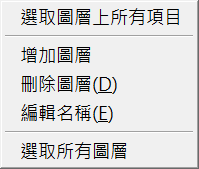

# レイヤ

レイヤを使用して FormIt オブジェクトの表示をコントロールします。

レイヤを使用した表示のコントロールについて詳しくは、[FormIt Primer](../formit-primer/part-i/control-visibility-with-layers.md) を参照してください。

## レイヤを作成して名前を付ける

レイヤを作成して名前を付けるには、[レイヤ]パネルで **[+]** アイコンをクリックします。

.jpg>)

名前をダブルクリックしてレイヤの名前を変更したり、左側のチェックボックスを使用してそのレイヤのオブジェクトの表示/非表示を切り替えることができます。右側のチェックボックスは、レイヤのロック/ロック解除に使用します。ロックされたレイヤは表示されたままですが、選択や編集はできません。

## レイヤ上のオブジェクトを管理する

キャンバス内でオブジェクトを選択し、[レイヤ]パネルの上部にあるドロップダウンを使用して、選択したオブジェクトを配置する先のレイヤを指定します。

FormIt には、「既定レイヤ」や「作業レイヤ」という概念がありません。新しく作成されるすべてのジオメトリは「レイヤなし」となるため、生成した後でオブジェクトをレイヤに再割り当てする必要があります。

レイヤを右クリックして[レイヤ上のすべてを選択]を選択すると、このレイヤに現在割り当てられているすべてのジオメトリを選択できます。

パネル内のレイヤをドラッグして新しい位置に動かすと、レイヤの順序を変更できます。ただし、この操作はジオメトリの表示には影響しません。パネル内が整理されるだけです。
