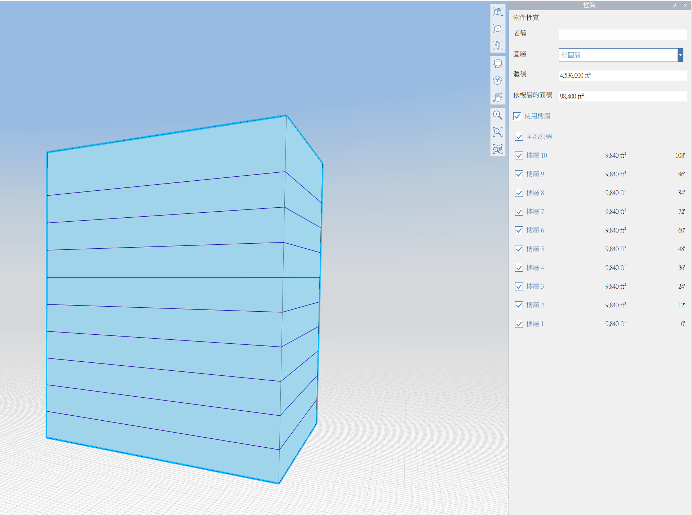

# Podlaží a plocha

Po vytvoření geometrie v aplikaci FormIt můžete použít podlaží k určení výšky podlaží a k výpočtům ploch.

Prostudujte si [příručku k aplikaci FormIt ](../formit-primer/part-i/adding-floors-with-levels.md)a zjistěte, jak podlaží fungují.

## Tvorba a konfigurace podlaží

Panel Podlaží se nachází na pravé straně aplikace FormIt pro systém Windows:

### Tvorba a odstraňování podlaží

* Kliknutím na tlačítko „+“ vytvoříte nové podlaží.
* Kliknutím na tlačítko „++“ vytvoříte řadu podlaží.
   * Můžete určit, kolik podlaží se má vytvořit, a zadat svislou vzdálenost mezi nimi.
* Chcete-li odstranit jedno nebo více podlaží, vyberte je a kliknutím na tlačítko „-“ je odstraňte.

### Přejmenování, nastavení výšek a přečíslování podlaží

* Chcete-li přejmenovat některé podlaží, dvakrát klikněte na jeho název nebo klikněte pravým tlačítkem myši a vyberte položku Upravit název.
* Výšku podlaží můžete upravit dvojitým kliknutím na číslo nebo kliknutím pravým tlačítkem myši a výběrem položky Upravit výšku.
* Chcete-li podlaží přečíslovat, klikněte na ikonu Obnovit v horní části.
   * To je užitečné, pokud jste přidali nebo odstranili podlaží a výchozí schéma pojmenování není synchronizované (tj. Podlaží 1, Podlaží 2, Podlaží 5).
   * Toto tlačítko bude ignorovat všechna podlaží s vlastními názvy, ale přečísluje všechna podlaží s názvem, který se řídí syntaxí „Podlaží 1“.

## Použití podlaží

Chcete-li použít podlaží na objekt, je nutné vybrat objekt a přejít na panel Vlastnosti.

Aby bylo možné použít podlaží na objekt, musí být objekt těleso, které nemá problémy se zadními plochami nebo vodotěsností. [Zjistěte, jak zkontrolovat, zda v modelu nejsou problémy s vodotěsností a zadními plochami](https://formit.autodesk.com/blog/post/repairing-solid-models).

Pokud je na kreslicí ploše vybrán objekt tělesa (v tomto příkladu jednoduchá skořepina budovy), na panelu Vlastnosti se zobrazí zaškrtávací políčko Použít podlaží.

* Jestliže již náčrt aplikace FormIt obsahuje definovaná podlaží (viz výše), zaškrtnutím tohoto políčka se použijí všechna podlaží, která by protínala tento tvar (přitom budou ignorována všechna podlaží, která by byla příliš vysoko nebo příliš nízko).
* Pokud náčrt aplikace FormIt ještě podlaží neobsahuje, zaškrtnutím tohoto políčka se vytvoří dostatek výchozích podlaží (s výškou 12' mezi podlažími) protínající celý tvar a tato podlaží se automaticky použijí na tento objekt.

## Podlaží a aplikace Revit

Pokud jsou u geometrie aplikace FormIt použita podlaží, budou tato podlaží odeslána do aplikace Revit pomocí [doplňku aplikace FormIt](https://formit.autodesk.com/page/formit-revit).

V aplikaci Revit můžete pomocí podlaží aplikace FormIt vytvářet podlaží objemu, podlaží na ploše a půdorysy podlaží přidružené k podlažím aplikace FormIt.
