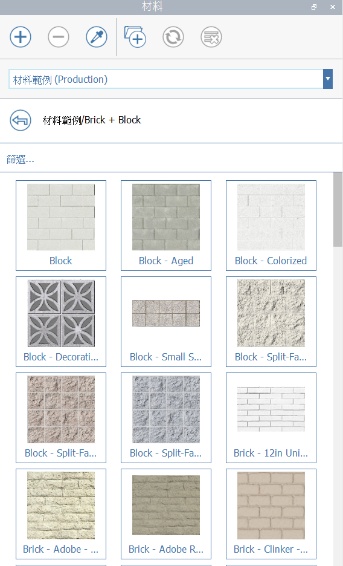
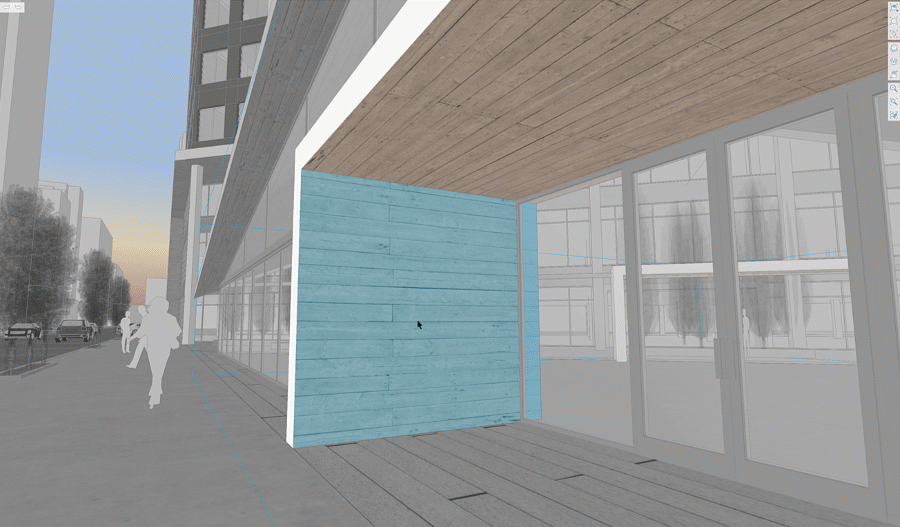

# Materiales

Consiga que los modelos de FormIt destaquen con materiales que admiten mapas de relieve o normales, brillo y reflexión.

## El panel Materiales

 (1).png>)

En el panel Materiales, puede elegir entre una amplia variedad de muestras de materiales, desplazarse entre las bibliotecas de materiales vinculadas y, a partir de FormIt 2021, acceder al contenido de materiales de otros archivos de FormIt (.AXM) y utilizarlos.

### Orígenes de la biblioteca de materiales

En FormIt 2021 y versiones posteriores, el panel Materiales tiene una interfaz desplegable para elegir entre diferentes orígenes disponibles de la biblioteca de materiales: En el boceto, Muestras de materiales y [bibliotecas vinculadas](https://windows.help.formit.autodesk.com/v/spanish/tool-library/materials#vinculacion-de-bibliotecas-de-materiales).

.png>)

#### En el boceto

Muestra los materiales guardados en el boceto de FormIt actual.

#### Muestras de materiales

Muestra una lista de materiales de muestra disponibles. Estas ofertas se almacenan en un servidor basado en la nube, por lo que tenga en cuenta lo siguiente:

* Se necesita una conexión a Internet para acceder por primera vez a las categorías de Muestras de materiales.
* Al acceder a una categoría por primera vez, se descargará y, a continuación, se almacenará en la memoria caché del equipo para que no sea necesario descargar nada en futuras sesiones.
* El equipo de FormIt puede actualizar ocasionalmente las ofertas de Muestras de materiales. Cuando esto suceda, FormIt suprimirá y volverá a descargar automáticamente las categorías para obtener la versión más reciente.

**Bibliotecas vinculadas**

Aparecerán otros directorios y ubicaciones después de [vincular bibliotecas de materiales](https://windows.help.formit.autodesk.com/v/spanish/tool-library/materials#vinculacion-de-bibliotecas-de-materiales).

### Crear, suprimir y cuentagotas

 **Cree un nuevo material** mediante la definición de los parámetros de color, textura, mapa de relieve o normal, mapa de corte, transparencia y reflexión/brillo.

.PNG>) **Suprima** los materiales seleccionados

 Utilice el **cuentagotas** para obtener un material pintado en la escena y empezar a pintar con él al instante.

* Haga clic en la herramienta Cuentagotas y, a continuación, haga clic en una cara pintada con un material.
* El material que se encuentre en la cara se resaltará en el panel y la herramienta Pincel se activará con ese material cargado.

### Actualizar, vincular bibliotecas y limpiar elementos no utilizados

 **Vincule bibliotecas de materiales** desde directorios locales. Los directorios que contengan archivos JPG, PNG o AXM (FormIt) mostrarán contenido. Consulte [Vinculación de bibliotecas de materiales](https://windows.help.formit.autodesk.com/v/spanish/tool-library/materials#vinculacion-de-bibliotecas-de-materiales) para obtener más información.

**Actualice** el directorio actual. Esta opción solo se activa al visualizar un directorio vinculado localmente (no en las listas En el boceto ni Muestras de materiales).

 **Limpie los materiales no utilizados** del boceto de FormIt actual.

Como es lógico, los materiales no utilizados se pueden acumular durante el proceso de iteración, pero esto puede aumentar considerablemente el tamaño del archivo si los materiales utilizan texturas de alta calidad.

Los materiales no utilizados aparecen con un nombre de color gris en la lista En el boceto.

Haga clic en la herramienta Limpiar elementos no utilizados para suprimir todos los materiales no utilizados. Por si tiene dudas, aparecerá primero una solicitud que le permitirá cancelar la operación. Este botón solo está activado en la lista En el boceto.

### Vinculación de bibliotecas de materiales

FormIt 2021 y versiones posteriores permiten vincular el panel Materiales a directorios (bibliotecas) locales que contienen contenido de materiales, incluidas carpetas de archivos JPG, PNG o de FormIt:

* Los **archivos JPG/PNG** se mostrarán como materiales, con los que se puede pintar directamente en el boceto de FormIt actual.
   * Al hacer clic en una miniatura, el archivo de imagen se convierte en un material de FormIt sobre la marcha y se copia en el boceto actual.
   * FormIt le enviará de nuevo al directorio En el boceto para ver el material que acaba de copiar en el boceto.
* **Los archivos de FormIt (*.axm)** se mostrarán como carpetas con un icono de FormIt.
   * Al hacer clic en las carpetas de archivos de FormIt, se mostrarán todos los materiales de FormIt guardados en ese archivo.
   * Tenga en cuenta que FormIt debe cargar parte del archivo para obtener el contenido del material, por lo que es posible los materiales de los archivos de mayor tamaño tarden más en mostrarse en el panel.

### Interacciones con materiales

**Pinte un material** haciendo clic una vez en la miniatura. Se activará la herramienta Pincel. A continuación, puede pasar el cursor sobre la geometría en el lienzo de FormIt y hacer clic en caras o grupos para pintarlos.

Una vez que esté en la herramienta Pincel, realice lo siguiente:

* Pinte caras y grupos haciendo clic una vez.
   * Al pintar grupos, el material se colocará en cascada en la geometría anidada y cubrirá cualquier superficie o grupo pintado con el material por defecto.
* Pinte sólidos completos. Para ello, haga doble clic en una cara para seleccionar todos los elementos enlazados.

También puede seleccionar primero caras y grupos y, a continuación, hacer clic una vez en la miniatura de un material para pintar la selección con él.

**Edite un material**. Para ello, haga doble clic en la miniatura, que mostrará el Editor de materiales (consulte la información mostrada a continuación).

**Cambie el nombre de un material**. Para ello, haga doble clic en el nombre.

**Identifique un material** pintado en la geometría. Para ello, selecciónelo y busque el icono resaltado que indica los materiales pintados en la geometría seleccionada.

**El material por defecto** se puede utilizar para "borrar" una cara o un grupo de materiales de forma eficaz. Cualquier geometría que no se haya pintado con un material se pinta de forma implícita con el material por defecto.

### Administración de listas

Ajuste el tamaño de las miniaturas. Para ello, ajuste la anchura de la columna (haga clic y arrastre la línea vertical a la derecha de Material).

Escriba en la barra "Filtro..." para filtrar por materiales específicos.

Los materiales con nombres que se muestran en gris son los que no se utilizan en el boceto actual.

## Crear y editar materiales

.png>)

Al crear o editar un material, aparecerá el cuadro de diálogo Editor de materiales, en el que puede personalizar lo siguiente:

* **Color**
* **mapas de imagen**
   * Haga clic en la miniatura para elegir un nuevo mapa.
   * Haga clic en el icono Guardar para guardar el mapa a fin de editarlo en otra aplicación.
   * Haga clic en el icono Suprimir para suprimir el mapa de este material.
      * **Textura de un archivo de imagen**
         * JPG o PNG
      * **Mapa de relieve o normal de un archivo de imagen**
         * JPG (recomendado)
         * Ideal para añadir efectos de profundidad a materiales.
         * Puede utilizar software gratuito como ShaderMap para generar mapas de relieve o normales en función de la textura especificada.
      * **Mapa de corte de un archivo de imagen**
         * PNG
         * Ideal para materiales con transparencia selectiva, como vallas con eslabones de cadena o paneles perforados.
* **Nombre**
* **Escala horizontal y vertical**
   * Si se ha activado, el botón Bloquear aspecto garantizará que la escala horizontal y la vertical respeten la relación de aspecto de la textura.
   * Estire un material ajustando la escala horizontal independientemente de la escala vertical.
   * Puede modificar la escala horizontal y vertical por cara mediante la herramienta Ajustar colocación del material (consulte la información mostrada a continuación).
* **Transparencia**, **Reflexión** y **Brillo**

## Ajuste de la posición del material

Al pintar un material en una cara, FormIt requiere una estimación de la mejor orientación:

* Las caras verticales se orientarán con la parte superior de la textura orientada a lo largo del eje Z.
* Las caras horizontales orientarán la textura longitudinalmente por todo el lado más largo de la cara.

Utilice la herramienta **Ajustar colocación del material** para modificar la posición por defecto del material, así como la escala del material en caras específicas:

* Seleccione una cara o caras pintadas con un material.
   * Si la cara hereda su material de su grupo principal, deberá pintar primero la cara directamente.
* Acceda a la herramienta Ajustar colocación del material a través del menú contextual MP o desde el menú contextual:

Utilice los controles en pantalla para mover y rotar las texturas de materiales directamente en la cara y ajustar su escala:

Para restablecer cualquiera de los cambios realizados en la posición del material, vuelva a pintar la cara con el material original del panel Materiales.

## Conversión de materiales a Revit

Los materiales se transferirán a Revit cuando se utilice el [complemento FormIt](https://formit.autodesk.com/page/formit-revit) para Revit 2018 o posterior.
