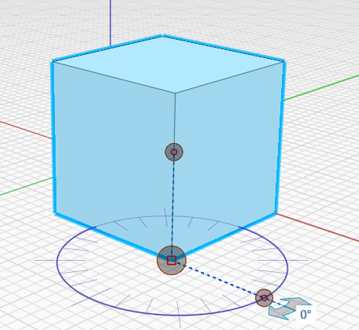
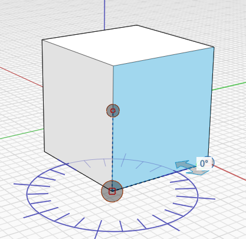
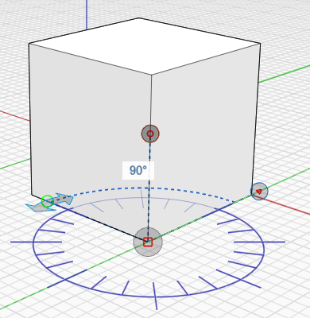
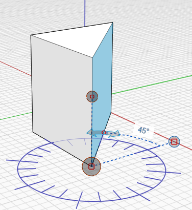

# Mesurer l’angle

L’outil Mesurer l’angle se trouve dans la [barre d’outils](../formit-introduction/tool-bars.md).

L’outil Mesurer l’angle permet de mesurer des angles entre des sommets, des arêtes, des faces et des volumes. Vous pouvez également utiliser l’outil Mesurer l’angle pour définir les cotes de la géométrie.

*   Dans le menu de la barre d’outils **Mesurer**, sélectionnez l’outil **Mesurer l’angle** ou utilisez le raccourci clavier **M A** et sélectionnez un point de départ.

    
*   Cliquez sur la poignée et faites-la glisser vers le sommet de départ.

    
*   Utilisez les flèches pour mesurer l’angle entre deux points.

    
*   Pour modifier la géométrie, cliquez sur une arête ou une face et cliquez sur l’angle affiché pour saisir une nouvelle valeur d’angle.

    
*   Vos modifications ou mesures s’affichent :

    
