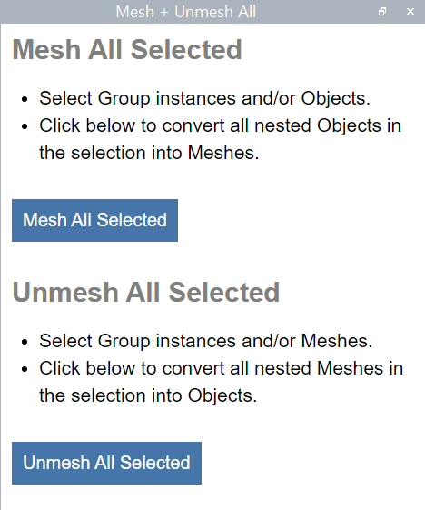

# メッシュ

v17.0 以降、FormIt では新しいタイプのジオメトリであるメッシュが提供されるようになりました。

メッシュは標準の FormIt オブジェクトの軽量な表現であり、家具などのポリゴン数の多いジオメトリや人、樹木、車、看板などの 3D 点景のパフォーマンスを向上させるのに役立ちます。メッシュは、FormIt のパフォーマンスに影響する可能性のある複雑な DWG ジオメトリにも最適です。

データを失うことなく、オブジェクトをメッシュに変換したり、メッシュをオブジェクトに戻すことができます。OBJ、STL、DWG など、一部のファイル タイプは自動的にメッシュとして読み込まれます。タイプ間の変換やメッシュのその他の利点と制限事項については、以下を参照してください。

## オブジェクトをメッシュに変換する

頂点、エッジ、面、またはソリッド ボディの任意の組み合わせをメッシュに変換できます。

オブジェクトを選択し、ショートカットの[OM] (オブジェクトをメッシュに)を使用するか、右クリックしてコンテキスト メニューから[オブジェクトをメッシュに]を選択します。

オブジェクトをメッシュに変換すると、画面の上部に確認メッセージが表示されます。

**オブジェクトをメッシュに変換する場合:**

* オブジェクト上でスムーズ化されたエッジは、作成されるメッシュでもそのスムーズな状態が維持されます。
* オブジェクトのマテリアルの方向は、結果のメッシュでも同じです。
* メッシュは適用されたすべてのマテリアルに作成されます。たとえば、6 色にペイントされた単一の立方体を変換すると、6 つの異なるメッシュが得られます。
   * オブジェクトに戻すと、個々のメッシュが再びシールされてソリッド ボディに戻ります。
* ソリッド ボディを選択すると、ボディ全体がメッシュに変換され置換されますが、ソリッドが所有する個々のエッジまたは頂点を選択すると、元のボディに影響を与えずに、既存のジオメトリ上に新しいメッシュが作成されます。
* エッジまたは頂点のセットを変換すると、単一のライン メッシュ(エッジで構成されるメッシュ)または単一のポイント メッシュ(点で構成されるメッシュ)が作成されます。単一のメッシュに結合した後では、個々のエッジや頂点を選択することはできません。単一の要素の位置を調整する場合は、オブジェクトに変換し直します。

**グループ化されたジオメトリをメッシュに変換する:**

* グループ全体と、そのネストされたすべてのグループをメッシュに変換すると、メッシュがさらに強力になります。
* グループとそのネストされた内容は、プラグインを使用してグループに変換できます。
   * アプリケーションの右側にある[Plugin Manager]アイコンを探します。
      * &#x20;
   * [Mesh + Unmesh All]プラグインのチェックボックスをクリックしてインストールします。
      * &#x20;
   * Mesh + Unmesh All プラグインがロードされます。メッシュに変換するオブジェクトを含むグループを選択し、[Mesh All]をクリックします。
      * &#x20;
   * このプラグインを使用してネストされたオブジェクトまたはメッシュを変換すると、画面の上部に、操作によって影響を受けたグループおよびグループのインスタンスの数を示す更新メッセージが表示されます。

## メッシュを操作する

**その軽量な性質から、メッシュには特定の制限と動作があります。**

* メッシュの個別の面、エッジ、頂点を編集することはできません。
   * ただし、メッシュを再ペイントし、面に異なるマテリアルを適用した結果として作成された各メッシュを移動することは可能です(上記参照)。
* メッシュへのスナップは、メッシュの面と頂点に制限されています。パフォーマンスを向上させるため、スナップと推定配置はメッシュのエッジでは機能しません。
   * ただし、メッシュに変換された DWG ファイル(ライン メッシュとして知られる、別のタイプのメッシュ)では、メッシュのエッジにスナップして推定配置できます。
* メッシュにレベルを適用することはできません。
* メッシュは、密封性の問題や背面の問題を報告しません。密封されているかどうかを確認する場合は、オブジェクトに戻します。&#x20;
   * メッシュに変換する前に密封されていたオブジェクトは、オブジェクトに変換し直しても密封性は保たれます。
* メッシュは、ソリッド結合/切り取り、3D シェル、3D オフセット、フィレット、ロフト、スイープ、かぶりなどの高度なモデリング操作では使用できません。

それ以外では、メッシュは他の FormIt オブジェクトと同様に表示され、動作します。グループに配置され、レイヤに割り当てられ、シーン内で可視化され、解析などに使用されます。

**ツールチップに「メッシュ上」と表示される場合や、[プロパティ]パレットにメッシュが表示される場合は、メッシュを操作していることがわかります。**

**パフォーマンスを向上させるために、一部のファイル タイプは自動的にメッシュとして読み込まれます**。

* 点群のような高密度のジオメトリを含む可能性のある他のアプリケーションの STL ファイルや OBJ ファイルは、自動的にメッシュとして読み込まれます。
* 高品質な曲線に数百万の小さなエッジ セグメントを含む可能性のある DWG ファイルは、自動的にメッシュとして読み込まれます。

## メッシュをオブジェクトに戻す

単にメッシュを選択し、ショートカットの[MO] (メッシュをオブジェクトに)を使用するか、右クリックしてコンテキスト メニューから[メッシュをオブジェクトに]を選択します。

オブジェクトをメッシュに変換すると、画面の上部に確認メッセージが表示されます。

**メッシュをオブジェクトに戻す場合:**

* メッシュに変換する前にソリッドまたは密封状態であったオブジェクトは、オブジェクトに戻す際に密封ソリッドに再結合されます。
* 一連のエッジ(DWG ファイルなど)または一連の頂点(点群など)をメッシュに変換して戻すと、メッシュされていないオブジェクトが自動的にグループになります。
   * これで、新しいエッジまたは頂点が他のジオメトリと結合するのを防ぐことができます。結合すると悪影響を与え、パフォーマンスに影響を与える可能性があります。
   * 作成されたグループをグループ解除するだけで、エッジや頂点を解放できます。

**グループ化されたメッシュをオブジェクトに戻す:**

* Mesh + Unmesh All プラグインを使用してグループとそのネストされたメッシュをオブジェクトに戻す方法については、上記の手順を参照してください。
