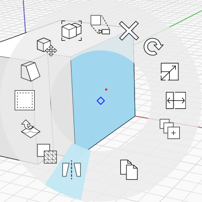
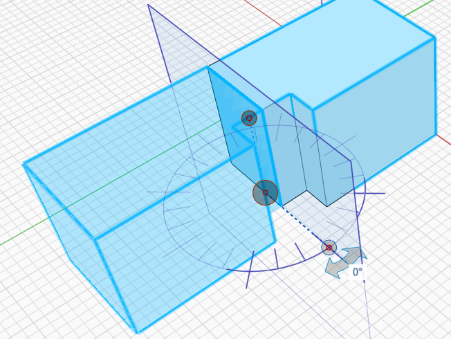

# Zrcadlit

Pomocí nástroje Zrcadlit můžete vytvořit zrcadlenou kopii objektu.

Zrcadlení objektu:

1. Dvojitým kliknutím vyberte jeden objekt nebo jedním kliknutím vyberte skupinu.&#x20;
2. Klikněte pravým tlačítkem myši a v místní nabídce vyberte nástroj Zrcadlit, případně stiskněte klávesovou zkratku **MI**.&#x20;
3. Zobrazí se rovina zobrazující osu, na které bude objekt zrcadlen. Rovinu lze posouvat nebo otáčet a přizpůsobit tak osu zrcadla.
4. Po dokončení úprav roviny zrcadleného objektu klikněte kamkoli mimo výběr.

