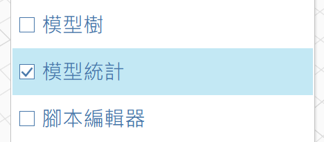
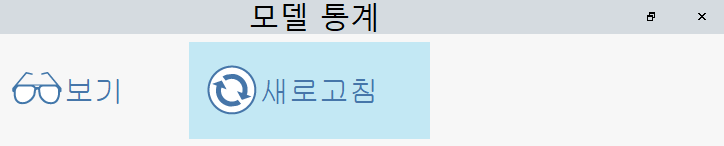

# 模型統計

「模型統計」選項板可讓您檢視 FormIt 模型統計。程式會顯示整體的模型統計，後面接每個群組 (以一個 History 識別) 的統計。

移至「視窗」功能表並勾選「模型統計」旁邊的方塊，以啟用「模型統計」選項板：

## 取得統計

若要產生統計，請按一下「重新整理」按鈕：

<figure><figcaption></figcaption></figure>

如果在模型中做了某些變更後要查看統計的變化，可以再次重新整理。

如果您開啟新檔案，即使您正在觀看 (請參閱下方)，也必須按一下「重新整理」按鈕，才能產生新模型的統計。

## 觀看

如果您希望模型統計在編輯模型時更新，請按一下「觀看」按鈕：

<figure><figcaption></figcaption></figure>

請注意，使用「觀看」可能會降低模型效能，尤其是在大型模型中。
