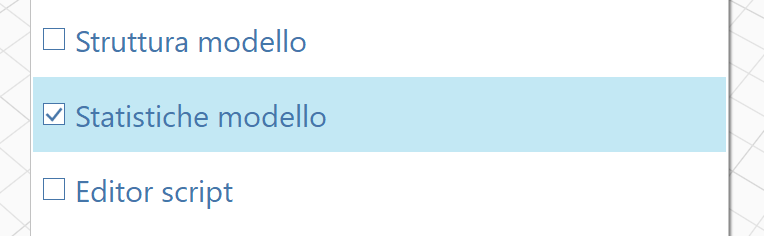

# Model Statistics

The Model Statistics palette provides a way to view statistics of your FormIt model.

Enable the Model Statistics by going to the Window menu and checking the box next to Model Statistics:

Inside the Model Statistics palette, overall statistics are displayed followed by statistics for each Group, identified as a History.&#x20;

&#x20;An example of the model level statistics is shown here:

<figure><figcaption></figcaption></figure>
