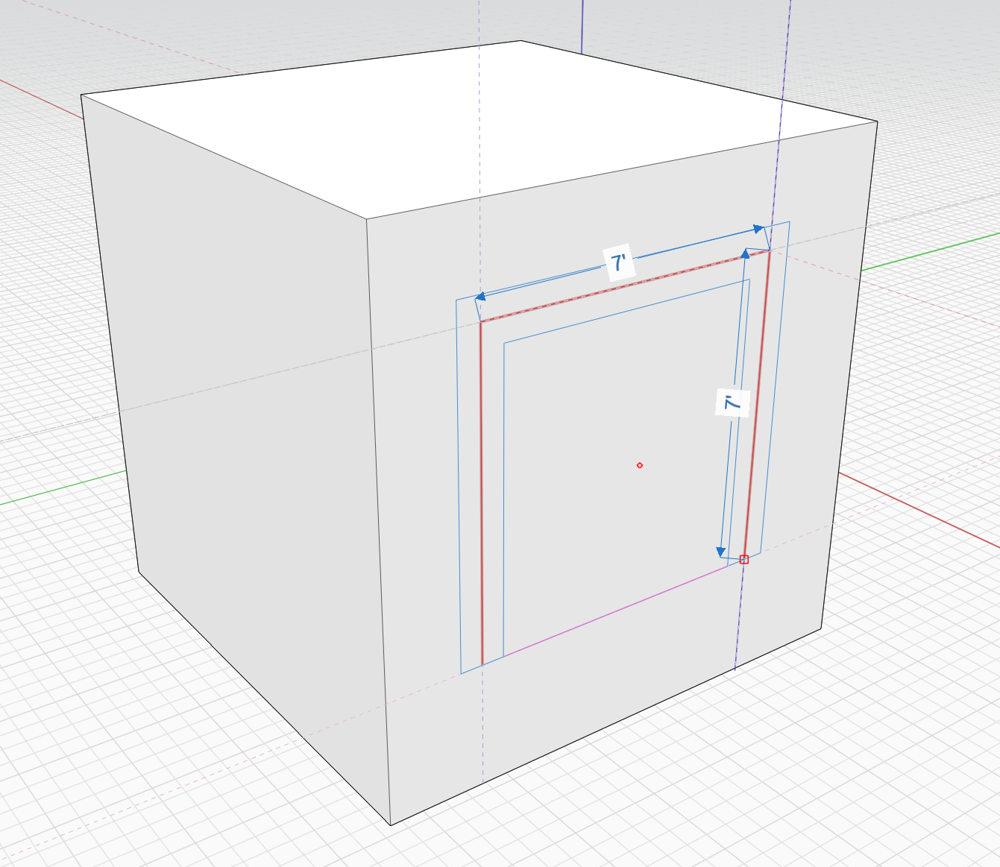

# Линия со смещением

Рисование параллельных или смещенных прямых с помощью инструмента «Линия со смещением». Используется при создании 2D-форм, которые впоследствии можно выдавить для создания 3D-стен.

.png>)

Инструмент **Линия со смещением** работает аналогично инструменту [**Линия**](https://windows.help.formit.autodesk.com/v/russian/tool-library/line-tool).

* Щелкните, чтобы задать первую точку, а затем переместите курсор и разместите последующие точки, выполняя привязку к существующей геометрии или к вспомогательным осям.&#x20;
* Отобразится предварительный вид созданной формы. Вторая и третья точки определяют плоскость для всех последующих точек, поэтому в результате получится 2D-форма.
* Продолжайте добавлять точки, а затем нажмите клавишу **ESC** или дважды щелкните мышью, чтобы завершить работу с инструментом.
* Все самопересечения будут очищены и объединены. Останется одна грань, которую можно выдавить.

Базовая линия выделяется красным цветом и по умолчанию размещается посередине между смещенных линий.

Чтобы изменить выравнивание линий со смещением и их толщину, нажмите клавишу **TAB**. Откроется диалоговое окно **Параметры инструмента**:

Измените, например, значение параметра **Выравнивание** на **По левому краю**, а значение параметра **Толщина** на 6", и смещенные линии будут проведены слева от базовой линии на расстоянии 6 дюймов.

## Полезные советы

Замкнутую форму можно нарисовать путем привязки к первой размещенной точке. Созданный угол будет очищен автоматически:

Базовые линии могут пересекаться. По завершении работы с инструментом имеющиеся пересечения будут очищены.

По сути, инструмент «Линия со смещением» создает геометрическую форму на плоскости, поэтому первые несколько точек определяют плоскость, на которой будут располагаться оставшиеся точки.

Начинайте рисовать, например, на грани куба, чтобы использовать плоскость этой грани. После размещения трех неколлинеарных точек базовая плоскость фиксируется для всех остальных точек и линий. Обратите внимание, что при рисовании на грани полученная форма будет размещена на самой грани, разделяя ее на несколько граней. Во избежание этого грань, вдоль которой выполняется размещение точек, должна входить в состав [группы](https://windows.help.formit.autodesk.com/v/russian/tool-library/groups).

Инструмент «Линия со смещением» можно также использовать для трассировки на основе чертежа плана. Импортируйте план как изображение.

* Измените размер изображения так, чтобы у плана был правильный масштаб. [Подробнее о том, как это сделать](https://windows.help.formit.autodesk.com/building-the-farnsworth-house/work-with-images-and-the-ground-plane).&#x20;
* [Ортогональную проекцию](orthographic-camera.md) можно использовать для трассировки в ортогональном [виде сверху](orthographic-views.md).

