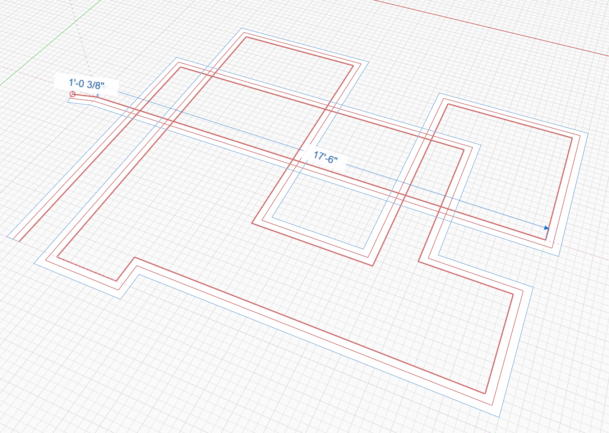
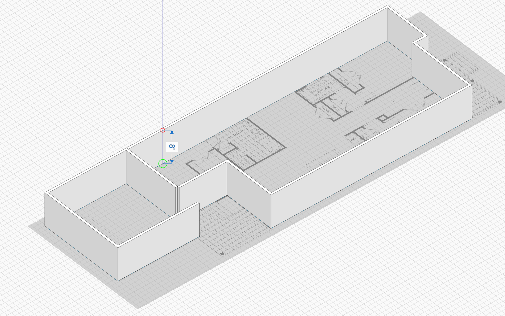

# オフセット ライン

[オフセット ライン]ツールを使用して、平行つまりオフセットの線分を描画します。これは、後で 3D 壁のように押し出す 2D 形状を作成する場合に便利です。

\ (1).png>)

**オフセット ライン** ツールは、[**線分**](https://windows.help.formit.autodesk.com/tool-library/line-tool)ツールと同様に機能します。

* クリックして最初の点を設定し、カーソルを移動して、既存のジオメトリまたは推定軸にスナップしながら後続の点を配置します。
* 作成した形状のプレビューが表示されます。2 番目と 3 番目の点によって、残りの点がフォローする平面が決まります。結果として平面になります。
* 続けて点を追加した後で、**[Esc]**を押すか、ダブルクリックしてツールを終了します。
* 自己交差はクリーンアップされ、結合されて、押し出し可能な 1 つの面になります。

入力線分は赤で描画され、既定ではオフセット ラインの中心に配置されます。

オフセット ラインの位置合わせと太さを変更するには、**[Tab]** キーを押します。これで、**[ツール オプション]**ダイアログが表示されます。

たとえば、**[位置合わせ]**を**[左]**に、**[厚さ]**を 6" に変更すると、オフセット ラインは入力線分の左に 6 インチの間隔で描画されます。

## 便利なヒント

最初に配置した点にスナップすると、閉じた形状を描画できます。作成されたコーナーは自動的にクリーンアップされます。

入力線分は自由に重ねて描画できます。ツールを終了すると、作成された交差はクリーンアップされます。

オフセット ライン ツールは、本来平面上にジオメトリを生成する必要があるため、最初の数点で残りの点が従う平面が決まります。

たとえば、立方体の側面から描画を開始して、その面の平面を使用します。同一線上にない 3 つの点が配置された後、残りの入力に対して入力平面が固定されます。面に描画すると、作成された形状が面に挿入され、複数の面に分割されることに注意します。挿入を防ぐには、描画する面が[グループ](https://windows.help.formit.autodesk.com/tool-library/groups)の一部である必要があります。

また、オフセット ライン ツールを使用して、平面図からトレースすることもできます。平面図をイメージとして読み込みます。

* 適切な尺度が平面図に設定されるように、イメージのサイズを変更します。詳細については、[この解説](https://windows.help.formit.autodesk.com/building-the-farnsworth-house/work-with-images-and-the-ground-plane)を参照してください。
* [正投影カメラ](orthographic-camera.md)を使用して、正投影の[上面ビュー](orthographic-views.md)でトレースすることができます。

