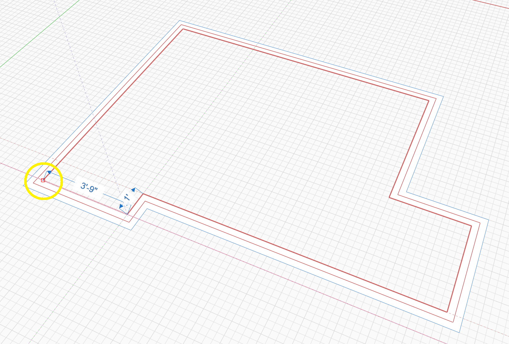

# 간격띄우기 선

간격띄우기 선 도구를 사용하여 평행선 또는 간격띄우기 선을 그립니다. 이 기능은 나중에 돌출되어 3D 벽처럼 보일 수 있는 2D 모양을 작성하는 데 유용합니다.

.png>)

**간격띄우기 선** 도구는 다음과 같이 [**선**](https://windows.help.formit.autodesk.com/v/korean/tool-library/line-tool) 도구처럼 작동합니다.

* 클릭하여 첫 번째 점을 설정한 다음, 커서를 이동하고 다음 점을 배치하여 기존 형상으로 스냅하거나 추정 축으로 스냅합니다.&#x20;
* 결과 모양의 미리보기가 표시됩니다. 두 번째 및 세 번째 점에 따라 나머지 점이 따를 평면이 결정되므로 결과는 평면이 됩니다.
* 점을 계속 추가하고 **Esc** 키를 누르거나 두 번 클릭하여 도구를 완료합니다.
* 자체 교차가 정리되고 병합되어 돌출 가능한 면 하나가 남게 됩니다.

입력 선은 빨간색으로 그려지고 기본적으로 간격띄우기 선의 중심에 배치됩니다.

**Tab** 키를 눌러 간격띄우기 선의 정렬과 해당 두께를 변경할 수 있습니다. 이렇게 하면 **도구 옵션** 대화상자가 호출됩니다.

예를 들어 **정렬**을 **왼쪽**으로, **두께**를 6"로 변경하면 간격띄우기 선이 입력 선의 왼쪽으로 6인치 떨어진 곳에 그려집니다.

## 유용한 팁

배치된 첫 번째 점으로 스냅하면 닫힌 모양을 그릴 수 있습니다. 결과 코너가 다음과 같이 자동으로 정리됩니다.

입력 선을 서로의 위에 자유롭게 그릴 수 있습니다. 도구가 완료되면 결과 교차점이 정리됩니다.

기본적으로 간격띄우기 선 도구는 평면에 형상을 생성해야 하므로, 처음 몇 개의 점에 따라 나머지 점이 따를 평면이 결정됩니다.

정육면체의 측면에서 그리기를 시작합니다(예: 해당 면의 평면 사용). 동일선상에 있지 않은 세 점이 배치된 후에는 입력 평면이 나머지 입력을 위해 고정됩니다. 면에 그릴 때 결과 모양이 면에 삽입되어 여러 면으로 분할됩니다. 삽입을 방지하려면 그리는 면이 [그룹](https://windows.help.formit.autodesk.com/v/korean/tool-library/groups)의 일부여야 합니다.

간격띄우기 선 도구를 사용하여 평면 도면에서 추적할 수도 있습니다. 평면을 이미지로 가져옵니다.

* 평면의 축척이 적절하도록 이미지 크기를 조정합니다. 이 내용은 [여기](https://windows.help.formit.autodesk.com/building-the-farnsworth-house/work-with-images-and-the-ground-plane)에 자세히 설명되어 있습니다.&#x20;
* [직교 카메라](orthographic-camera.md)를 사용하여 직교 [평면도](orthographic-views.md)에서 추적할 수 있습니다.

