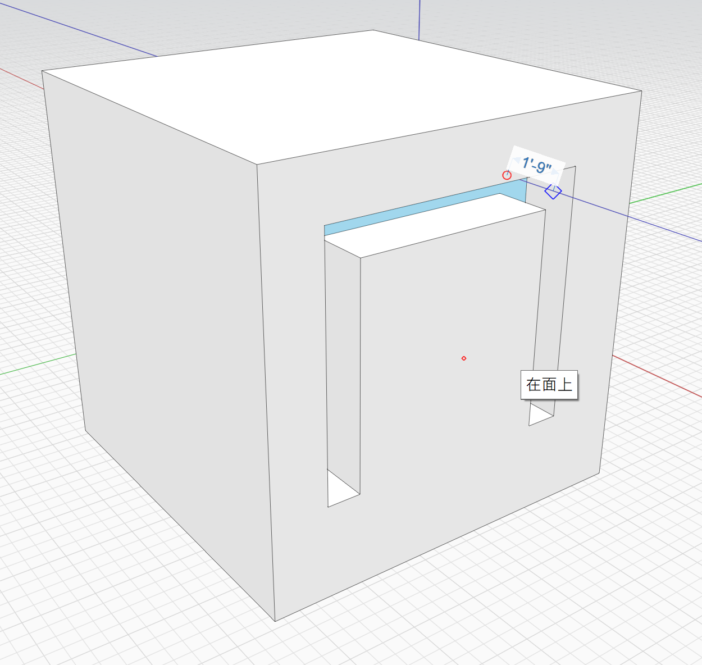

# Linia odsunięcia

Rysuj linie równoległe (czyli odsunięte) za pomocą narzędzia Linia odsunięcia. Jest to przydatne do tworzenia kształtów 2D, które można później wyciągać, aby wyglądały jak ściany 3D.

.png>)

Narzędzie **Linia odsunięcia** działa podobnie jak narzędzie [**Linia**](https://windows.help.formit.autodesk.com/v/polish/tool-library/line-tool):

* Kliknij, aby ustawić pierwszy punkt, a następnie przesuń kursor i umieść kolejne punkty, przyciągając do istniejącej geometrii lub osi odniesienia.&#x20;
* Zostanie wyświetlony podgląd wynikowego kształtu. Drugi i trzeci punkt określają płaszczyznę dla kolejnych punktów, więc wynikowa całość jest płaska.
* Dodawaj kolejne punkty, a następnie naciśnij klawisz **Escape** lub kliknij dwukrotnie, aby zakończyć pracę z narzędziem.
* Wszystkie przecięcia wewnętrzne zostaną wyczyszczone i scalone, pozostawiając jedną gotową do wyciągnięcia powierzchnię.

Linia wejściowa jest rysowana na czerwono i jest domyślnie umieszczana w środku linii odsunięcia.

Dopasowanie linii odsunięcia i ich grubość można zmienić, naciskając klawisz **Tab**. Spowoduje to wywołanie okna dialogowego **Opcje Narzędzia**:

Zmień ustawienie opcji **Wyrównanie** na **Lewo** i opcji **Grubość** na 6", a linie odsunięcia będą rysowane po lewej stronie linii wejściowych w odległości 6 cali od siebie.

## Przydatne porady

Przyciągając do pierwszego umieszczonego punktu, można narysować zamknięty kształt. Wynikowy narożnik zostanie automatycznie wyczyszczony:

Linie wejściowe można dowolnie rysować jedna na drugiej. Po zakończeniu działania narzędzia przecięcia wynikowe są czyszczone.

Narzędzie Linia odsunięcia musi generować geometrię na płaszczyźnie: pierwszych kilka punktów określa płaszczyznę, za którą będą podążać pozostałe punkty.

Na przykład rozpocznij rysowanie od boku sześcianu, aby użyć płaszczyzny tej powierzchni. Po umieszczeniu trzech niewspółliniowych punktów płaszczyzna wejściowa jest stała dla pozostałej części danych wejściowych. Należy pamiętać, że podczas rysowania na powierzchni kształt wynikowy jest wstawiany na tej powierzchni, co dzieli ją na wiele powierzchni. Aby można było zapobiec temu wstawieniu, rysowana powierzchnia musi być częścią [grupy](https://windows.help.formit.autodesk.com/v/polish/tool-library/groups).

Można również użyć narzędzia Linia odsunięcia, aby śledzić dane z rysunku rzutu. Zaimportuj rzut jako obraz.

* Zmień rozmiar obrazu, tak aby rzut miał odpowiednią skalę. Jest to szczegółowo opisane [tutaj](https://windows.help.formit.autodesk.com/building-the-farnsworth-house/work-with-images-and-the-ground-plane).&#x20;
* Za pomocą [kamery prostopadłej](orthographic-camera.md) można śledzić w prostokątnym [widoku z góry](orthographic-views.md).

