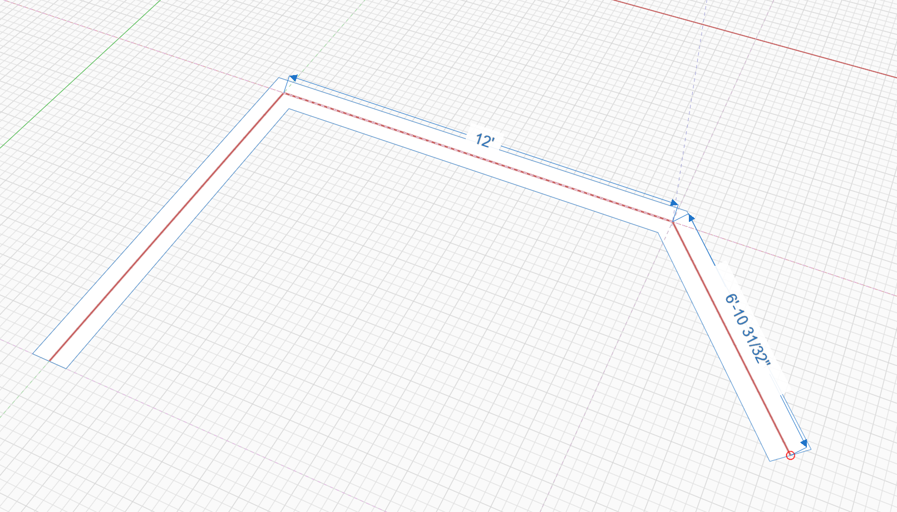
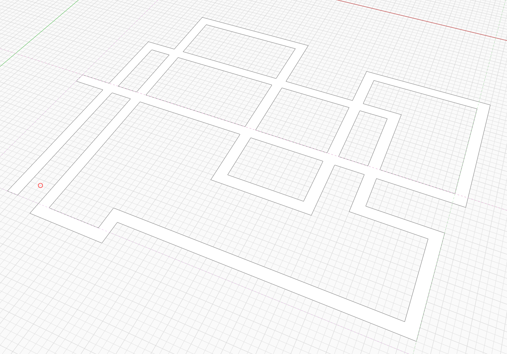

# Linha de deslocamento

Desenhe linhas paralelas ou de deslocamento usando a ferramenta Linha de deslocamento. Isso será útil para criar formas 2D das quais é possível efetuar a extrusão para que se pareçam com paredes 3D.

\ (1).png>)

A ferramenta **Linha de deslocamento** funciona como a ferramenta [**Linha**](https://windows.help.formit.autodesk.com/tool-library/line-tool):

* Clique para definir o primeiro ponto e, em seguida, mova o cursor e insira os pontos subsequentes, efetuando o snap à geometria existente ou aos eixos de inferência.
* Uma visualização da forma resultante é exibida. O segundo e o terceiro pontos determinam o plano para o resto dos pontos a seguir, de forma que o resultado seja plano.
* Continue adicionando pontos e pressione **Esc** ou clique duas vezes para concluir a ferramenta.
* As autointerseções serão limpas e mescladas, deixando você com uma face que pode ser extrudada.

A linha de entrada é desenhada em vermelho e, por padrão, é colocada no centro das linhas de deslocamento.

É possível alterar o alinhamento das linhas de deslocamento e sua espessura pressionando a tecla **Tab**. Isso chamará a caixa de diálogo **Opções de ferramentas**:

Altere o **Alinhamento** para **Esquerda** e a **Espessura** para 6", por exemplo, e as linhas de deslocamento serão desenhadas à esquerda das linhas de entrada, com 6 polegadas de distância.

## Dicas úteis

É possível desenhar uma forma fechada ao efetuar o snap ao primeiro ponto inserido. O canto resultante será limpo automaticamente:

É possível desenhar livremente as linhas de entrada umas sobre as outras. Quando a ferramenta é finalizada, as interseções resultantes são limpas.

Inerentemente, a ferramenta Linha de deslocamento deve gerar geometria em um plano, de modo que os primeiros pontos determinem o plano que os pontos restantes seguirão.

Comece a desenhar na lateral de um cubo, por exemplo, para usar o plano dessa face. Após três pontos não colineares serem colocados, o plano de entrada é fixado para o restante da entrada. Observe que, ao desenhar em uma face, a forma resultante é inserida na face, dividindo-a em várias faces. Para evitar a inserção, a face desenhada deve fazer parte de um [Grupo](https://windows.help.formit.autodesk.com/tool-library/groups).

Também é possível usar a ferramenta Linha de deslocamento para traçar com base em um desenho de planta. Importe a planta como uma imagem.

* Redimensione a imagem para que a planta tenha a escala apropriada. Isso é descrito em mais detalhes [aqui](https://windows.help.formit.autodesk.com/building-the-farnsworth-house/work-with-images-and-the-ground-plane).
* É possível usar a [Câmera ortogonal](orthographic-camera.md) para traçar em uma [vista superior](orthographic-views.md) ortogonal.

