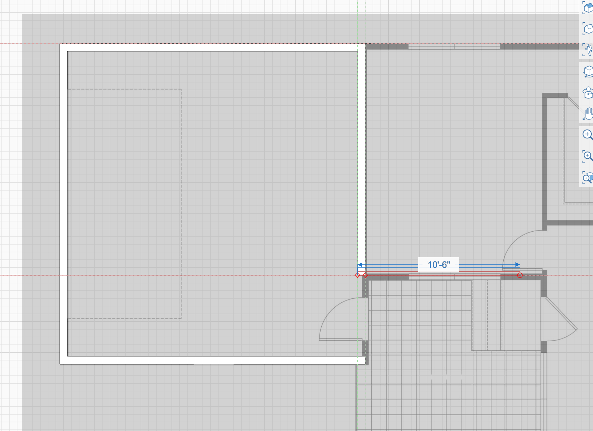

# 偏移線

使用「偏移線」工具繪製平行 (或稱偏移) 線。這有助於建立 2D 造型，稍後可以擠出為類似 3D 牆的外觀。

\ (1).png>)

**偏移線**工具的運作方式與[**直線**](https://windows.help.formit.autodesk.com/tool-library/line-tool)工具類似：

* 按一下可設定第一個點，然後移動游標並放置後續的點，鎖點至既有幾何圖形或推論軸。
* 會顯示產生造型的預覽。第二點和第三點決定其餘點要遵循的平面，因此結果為平面。
* 繼續加入點，然後按 **Esc** 或按兩下完成工具。
* 所有自我相交都會被清理並合併，讓您有一個可擠出的面。

輸入線以紅色繪製，並依預設放置在偏移線的中心。

您可以按一下 **Tab** 鍵變更偏移線的對齊方式及其厚度。這會呼叫 **「工具選項」** 對話方塊：

例如，將 **「對齊」** 變更為 **「靠左」**，將 **「厚度」** 變更為 6"，偏移線將繪製在輸入線的左側距離 6 英寸。

## 有用的秘訣

您可以鎖點至放置的第一個點，以繪製封閉造型。產生的角將會自動清理：

您可以在彼此上方自由繪製輸入線。完成工具後，會清理產生的交點。

「偏移線」工具本身必須在平面上產生幾何圖形，因此前幾個點決定其餘點將遵循的平面。

例如在立方體的一側開始繪製，以使用該面的平面。放置三個非共線的點後，輸入平面就固定下來供剩餘的輸入遵循。請注意，在面上繪製時，產生的造型會插入面，並分割為多個面。若要避免插入，您繪製的面必須是[群組](https://windows.help.formit.autodesk.com/tool-library/groups)的一部分。

您也可以使用「偏移線」工具從平面圖面追蹤。將平面匯入為影像。

* 調整影像大小，讓平面具有適當的比例。[這裡](https://windows.help.formit.autodesk.com/building-the-farnsworth-house/work-with-images-and-the-ground-plane)有更詳細的描述。
* 您可以使用[正投影相機](orthographic-camera.md)在正投影[上視圖](orthographic-views.md)中追蹤。

