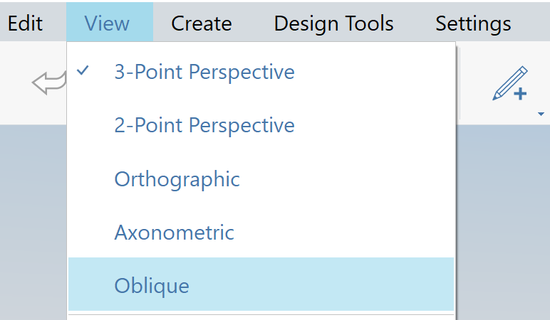

# Orthogonale und perspektivische Kamera

FormIt 2023 enthält mehrere Optionen für orthogonale und perspektivische Kameras. Sie finden die Schaltflächen Orthogonal, 2-Punkt-Perspektive und 3-Punkt-Perspektive im verschiebbaren Navigationsmenü:

### 3-Punkt-Perspektive

* Dies ist die vorgegebene perspektivische Kamera. Bei bestimmten Kamerawinkeln scheinen vertikale Linien in der Nähe der Oberkante der Kamera zu konvergieren.
* Die in diesem Modus eingestellte Kameraposition definiert die Schnittebene für die orthogonale Kamera.
* In diesem Modus können Sie mit STRG + Zoom in gleichmäßigem Abstand zoomen, ohne dass beim Annähern der Kamera an Objekte eine Verlangsamung erfolgt.

### 2-Punkt-Perspektive

* Diese Kamera ähnelt der 3-Punkt-Perspektive, sie stellt jedoch sicher, dass vertikale Linien vertikal bleiben.
* Bei bestimmten Kamerawinkeln kann Geometrie verzerrt erscheinen, um vertikale Linien immer vertikal zu halten.
* Die in diesem Modus eingestellte Kameraposition definiert die Schnittebene für die orthogonale Kamera.
* In diesem Modus können Sie mit STRG + Zoom in gleichmäßigem Abstand zoomen, ohne dass beim Annähern der Kamera an Objekte eine Verlangsamung erfolgt.
* 2-Punkt-Perspektive ist ebenfalls ein Arbeitsmodus, daher werden Sie feststellen, dass vertikale Linien auch dann vertikal bleiben, wenn sich die Kamera ändert. Dadurch kann die Szene bei bestimmten Kamerawinkeln verzerrt werden.

### Orthogonale

* Ein orthogonaler Projektionsmodus, der für Diagramme, 3D-Detailzeichnungen und andere nicht perspektivische Grafiken nützlich ist.
* Die in einem der beiden Perspektivmodi festgelegte Kameraposition definiert die Schnittebene für die orthogonale Kamera. Wenn Sie feststellen, dass Ihre Szene unerwartet abgeschnitten wird, wechseln Sie in den Perspektivmodus, verkleinern die Ansicht und wechseln dann zurück in den orthogonalen Modus.

### Verwenden der Modi

Die Kameramodi sind vollständige Arbeitsmodi, d. h., Sie haben in jedem beliebigen Modus Zugriff auf Navigations- und Zeichenwerkzeuge. Über das Menü können Sie einfach zwischen den verschiedenen Kameras wechseln. 

Wenn Sie eine Kamera ausgewählt haben, berücksichtigen alle anderen Kamerawerkzeuge den aktuellen Modus. Beispiel: **Kamera an Fläche ausrichten** richtet die orthogonale Kamera an der Fläche aus, wodurch eine orthogonale Ansicht entsteht.

Wenn Sie manuell zu einer voreingestellten orthogonalen Ansicht wie Draufsicht oder Vorderansicht navigieren, fängt die orthogonale Kamera diese Position, sodass der Zugriff auf diese voreingestellten Ansichten erleichtert wird.

### Axonometrisch

Zusätzlich zu den in der Navigationsleiste verfügbaren Kameraoptionen Orthografisch und Perspektivisch bietet FormIt eine axonometrische Kamera, die nur über das Menü Ansicht verfügbar ist (nur Windows):

<figure><figcaption></figcaption></figure>

Bei Auswahl dieser Option wird die Kamera in die axonometrische Ansicht versetzt:

<figure><figcaption></figcaption></figure>

### Schräg

FormIt bietet außerdem eine schräge Kamera, die nur im Menü Ansicht verfügbar ist (nur Windows):

<figure><figcaption></figcaption></figure>

Bei Auswahl dieser Option wird die Kamera in die schräge Ansicht versetzt:

<figure><figcaption></figcaption></figure>
