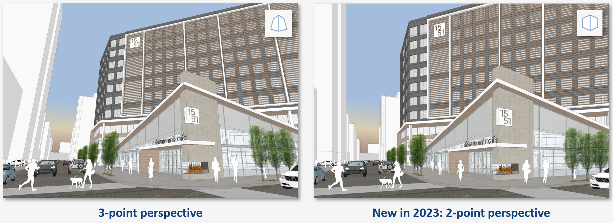

# Orthographic and Perspective Camera

FormIt 2023 includes multiple orthographic and perspective camera options. You can find the Orthographic, 2-Point Perspective, and 3-Point Perspective buttons in the floating navigation menu:

This menu allows you to easily toggle between the different cameras.&#x20;

.gif>)

Added in FormIt 2023, the 2-point perspective camera is useful for keeping vertical lines vertical, for example, when taking a screenshot of your model.

The camera modes are all full working modes, with access to navigation and drawing tools in any mode you prefer.

Once you've selected a camera, any other camera tools will respect the current mode. For example, **Align Camera to Face** will align the Orthographic Camera to the face, resulting in an orthographic elevation view.

If you navigate manually to a pre-set Orthographic View, like Top View, or Front View, the Orthographic Camera will snap to that position, making it easier to access those pre-set views.

**Note:** If camera clipping occurs in Orthographic Camera mode, you can switch back to Perspective Mode, zoom out, and then try again.
