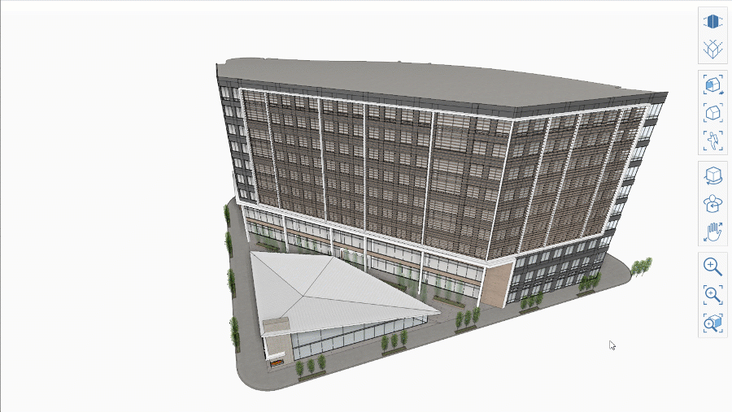

# 正交和透视相机

FormIt 2023 包含多个正交和透视相机选项。可以在浮动导航菜单中找到“正交”、“两点透视”和“三点透视”按钮：

### 三点透视

* 这是默认的透视相机。在某些相机角度，垂直线看起来将会聚在相机顶部附近。
* 在此模式下设置的相机位置将定义正交相机的剪裁平面。
* 在此模式下按住 Ctrl 键并进行缩放将允许以恒定速率进行缩放，而不会随着相机接近对象而减速。

### 两点透视

* 此相机类似于三点透视，但可确保垂直线保持垂直。
* 在某些相机角度，几何图形可能会出现扭曲，以使垂直线始终垂直。
* 在此模式下设置的相机位置将定义正交相机的剪裁平面。
* 在此模式下按住 Ctrl 键并进行缩放将允许以恒定速率进行缩放，而不会随着相机接近对象而减速。
* 两点透视也是一种工作模式，因此您会注意到：即使相机发生变化，垂直线也保持垂直 - 这可能会在某些相机角度扭曲场景

### 正视

* 正交投影模式适用于图表、三维详图和其他非透视图形。
* 在两种透视模式的任一模式下设置的相机位置定义正交相机的剪裁平面。如果您发现场景意外被剪裁，请切换到透视模式、然后缩小，再切换回正交模式。

### 使用模式

相机模式都是完整的工作模式，可以在您喜欢的任何模式下访问导航和绘图工具。通过该菜单，可以轻松在不同的相机之间切换。

选择相机后，任何其他相机工具都会遵循当前模式。例如，**“将相机与面对齐”**会将正交相机与面对齐，从而生成正交立面视图。

如果手动导航到预设的“正交视图”（如“俯视图”或“前视图”），则“正交相机”会捕捉到该位置，从而更轻松地访问这些预设视图。

### 三向投影

除了“导航工具栏”中提供的“正交”和“透视”相机选项之外，FormIt 还提供了一个只能从“视图”菜单访问的“三向投影相机”（仅限 Windows）：

<figure><figcaption></figcaption></figure>

选择此选项会将相机置于“三向投影”视图中：

<figure><figcaption></figcaption></figure>

### 倾斜

FormIt 还提供了只能通过“视图”菜单访问的“倾斜相机”（仅限 Windows）：

<figure><figcaption></figcaption></figure>

选择此选项会将相机置于“倾斜”视图中：

<figure><figcaption></figcaption></figure>
