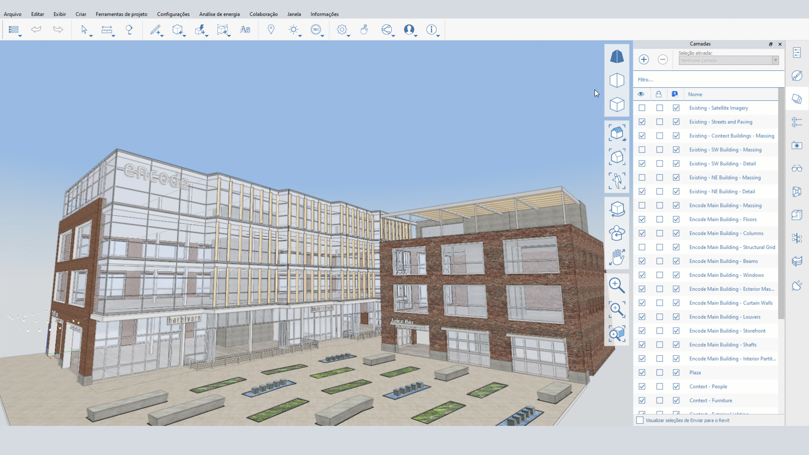

# Orthographic and Perspective Camera

FormIt 2023 includes multiple orthographic and perspective camera options. You can find the Orthographic, 2-Point Perspective, and 3-Point Perspective buttons in the floating navigation menu:

### 3-Point Perspective

* This is the default perspective camera. At certain camera angles, vertical lines will appear to converge near the top of the camera.
* The camera position set in this mode will define the clipping plane for the orthographic camera.
* Ctrl + zoom in this mode will allow zooming at a constant rate, without slowing down as the camera approaches objects.

### 2-Point Perspective

* This camera is similar to 3-point perspective, but it ensures that vertical lines stay vertical.
* At certain camera angles, geometry may appear distorted to keep vertical lines vertical at all times.
* The camera position set in this mode will define the clipping plane for the orthographic camera.
* Ctrl + zoom in this mode will allow zooming at a constant rate, without slowing down as the camera approaches objects.
* 2-point perspective is also a working mode, so you'll notice vertical lines remain vertical even as the camera changes - this can distort the scene at certain camera angles

### Orthographic

* An orthographic projection mode useful for diagrams, 3D detail drawings, and other non-perspective graphics.
* The camera position set in either of the two perspective modes defines the clipping plane for the orthographic camera. If you see your scene getting clipped unexpectedly, switch to a perspective mode, and zoom out, then switch back to orthographic mode.

### Using the Modes

The camera modes are all full working modes, with access to navigation and drawing tools in any mode you prefer. The menu allows you to easily toggle between the different cameras.&#x20;

Once you've selected a camera, any other camera tools will respect the current mode. For example, **Align Camera to Face** will align the Orthographic Camera to the face, resulting in an orthographic elevation view.

If you navigate manually to a pre-set Orthographic View, like Top View, or Front View, the Orthographic Camera will snap to that position, making it easier to access those pre-set views.

