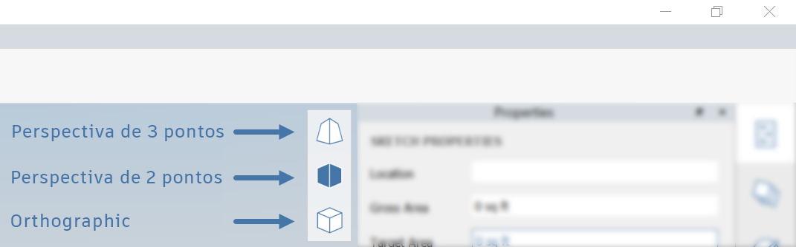
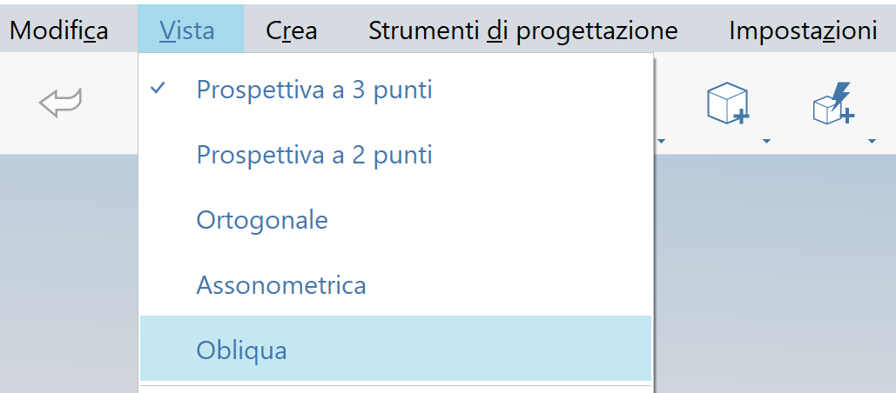

# Câmera ortogonal e em perspectiva

O FormIt 2023 inclui várias opções de câmera ortogonal e em perspectiva. É possível encontrar os botões Ortogonal, Perspectiva de 2 pontos e Perspectiva de 3 pontos no menu de navegação flutuante:

### Perspectiva de 3 pontos

* Essa é a câmera em perspectiva padrão. Em determinados ângulos da câmera, as linhas verticais parecem convergir perto da parte superior da câmera.
* A posição da câmera definida nesse modo define o plano de corte da câmera ortogonal.
* A opção Ctrl + zoom nesse modo permite aplicar zoom em uma taxa constante, sem diminuir a velocidade à medida que a câmera se aproxima dos objetos.

### Perspectiva de 2 pontos

* Essa câmera é similar à perspectiva de 3 pontos, mas garante que as linhas verticais permaneçam verticais.
* Em determinados ângulos da câmera, a geometria pode parecer distorcida para manter as linhas verticais constantemente.
* A posição da câmera definida nesse modo define o plano de corte da câmera ortogonal.
* A opção Ctrl + zoom nesse modo permite aplicar zoom em uma taxa constante, sem diminuir a velocidade à medida que a câmera se aproxima dos objetos.
* A perspectiva de 2 pontos também é um modo de trabalho; portanto, você pode observar que as linhas verticais permanecem verticais, mesmo quando a câmera muda. Isso pode distorcer a cena em determinados ângulos de câmera

### Ortogonal

* Um modo de projeção ortogonal útil para diagramas, desenhos de detalhes 3D e outros gráficos que não estão em perspectiva.
* A posição da câmera definida em um dos dois modos de perspectiva define o plano de corte da câmera ortogonal. Se a cena for cortada inesperadamente, alterne para um modo de perspectiva, diminua o zoom e, em seguida, volte para o modo ortogonal.

### Usar os modos

Todos os modos de câmera são modos de trabalho completos, com acesso às ferramentas de navegação e desenho em qualquer modo que você preferir. O menu permite alternar facilmente entre as diferentes câmeras. 

Após selecionar um tipo de câmera, todas as outras ferramentas de câmera estarão de acordo com o modo atual. Por exemplo, **Alinhar câmera com a face** alinhará a câmera ortogonal com a face, resultando em uma vista de elevação ortogonal.

Se você navegar manualmente para uma vista ortogonal predefinida, como Vista superior ou Vista frontal, a Câmera ortogonal efetuará o snap para essa posição, tornando mais fácil acessar essas vistas predefinidas.

### Axonométrica

Além das opções Ortogonal e Câmera em perspectiva, disponíveis na barra de ferramentas de navegação, o FormIt oferece uma Câmera axonométrica, disponível somente no menu Vista (somente Windows):

<figure><figcaption></figcaption></figure>

Ao selecionar essa opção, a câmera será colocada na vista Axonométrica:

<figure><figcaption></figcaption></figure>

### Oblíquo

O FormIt também oferece uma Câmera oblíqua, disponível somente no menu Vista (somente Windows):

<figure><figcaption></figcaption></figure>

Ao selecionar essa opção, a câmera será colocada na vista Oblíqua:

<figure><figcaption></figcaption></figure>
