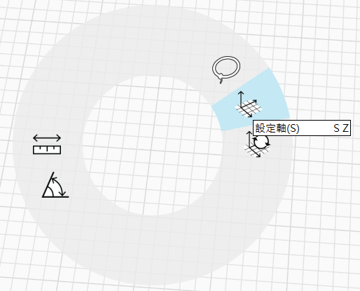

# Ортогональные виды

Модель можно просматривать в различных ортогональных видах, включая вид сверху, вид сбоку и вид снизу.

Ортогональные виды можно найти в меню «Вид», щелкнув значок «Ортогональный» на плавающей панели навигации, или с помощью сочетания клавиш V+O. Щелкните значок «Вид сверху» на плавающей панели навигации, чтобы получить доступ к нескольким параметрам просмотра.

**Полезные советы по работе с ортогональными видами**

* При переключении между ортогональными видами FormIt поддерживает уровень масштабирования для обеспечения согласованности.
* При переключении между видами фасадов (спереди/справа/слева/сзади) в FormIt будет поддерживаться постоянная высота уровня земли для обеспечения согласованности.
* При панорамировании в ортогональном виде можно удерживать нажатой клавишу SHIFT, чтобы заблокировать перемещение панорамирования по горизонтальной или вертикальной оси.
*   Направления ортогонального вида определяются осями глобальной системы координат. Можно перебазировать оси, что приведет к изменению ориентации всех ортогональных видов.

    * Используйте комбинацию клавиш S + Z или щелкните правой кнопкой мыши в пустом пространстве.

    

    * Задайте начало координат и укажите ручку на красных осях, чтобы выполнить выравнивание по направлению.

    

**В ортогональных видах поддерживаются другие функции FormIt.**

* Можно сохранять виды фасадов в виде сцен, чтобы вернуться к ним позже.
* Можно управлять видимостью геометрии, которая может помешать работе с видами фасадов, с помощью слоев.
* Можно добавлять секущие плоскости для создания уровней-сечений.
