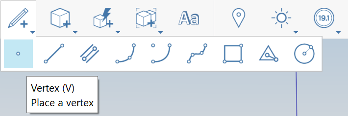
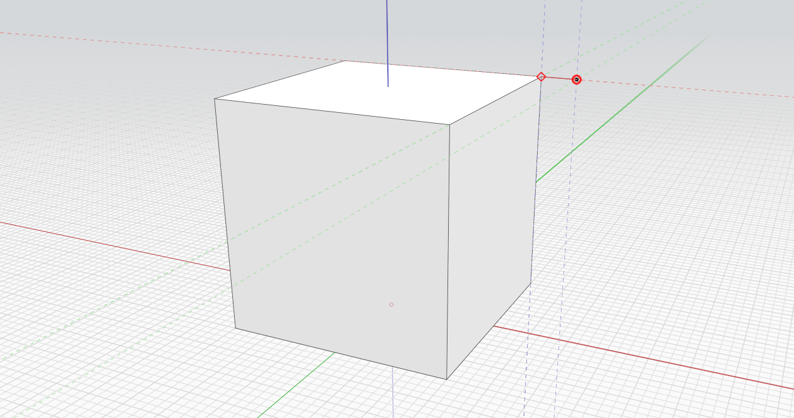

# Posicionar vértice

1.  Na [barra de ferramentas de ação](https://github.com/FormIt3D/autodesk-formit-360-windows-help/tree/c377e7b8a3b8e43e684321d0b7de867608d317a3/tool-library/tool-bars-extended.md), clique para abrir o **botão Esboço** e [selecione](select-edge-face-or-object.md) o vértice. 

    <figure><figcaption></figcaption></figure>
2. **Clique para posicionar** o vértice. 
3. Observe que é possível posicionar um vértice em uma aresta para dividir a aresta. Caso contrário, o vértice permanecerá visível como um vértice independente se for posicionado em uma face ou no espaço.

<figure><figcaption></figcaption></figure>

<figure><figcaption></figcaption></figure>

1.
