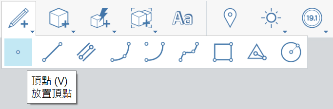

# Placer un sommet

1.  Dans la [barre d’outils Action](https://github.com/FormIt3D/autodesk-formit-360-windows-help/tree/c377e7b8a3b8e43e684321d0b7de867608d317a3/tool-library/tool-bars-extended.md), cliquez sur le **bouton Esquisse** et [sélectionnez](select-edge-face-or-object.md) le sommet. 

    <figure><figcaption></figcaption></figure>
2. **Cliquez pour placer** le sommet. 
3. N.B. : vous pouvez placer un sommet sur une arête pour la scinder. Autrement, le sommet reste visible en tant que sommet autonome s’il est placé sur une face ou dans un espace.

<figure><figcaption></figcaption></figure>

<figure><figcaption></figcaption></figure>

1.
