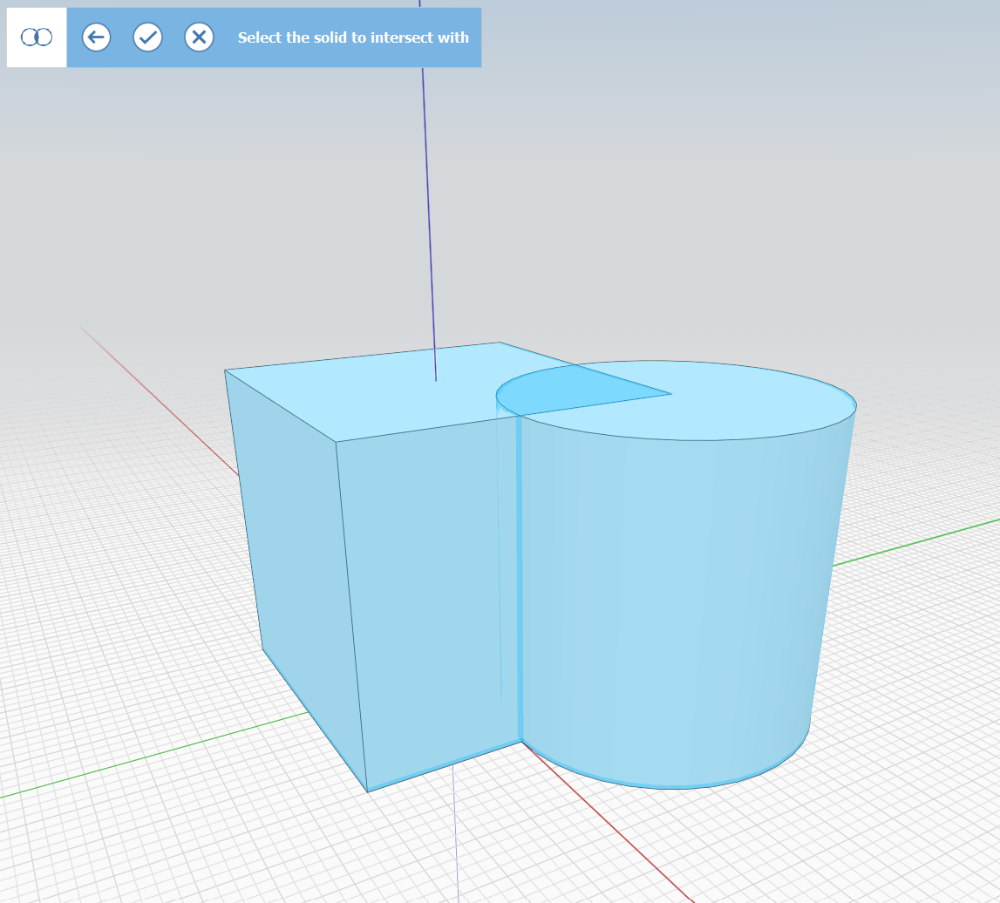

# Polygon

Use the Polygon tool to draw a regular n-sided polygon in space or on another object.

 (1).png>)

Start the polygon and click to choose the center point. Specify the radius by drawing the second point, typing in a dimension, or hitting **Tab** to bring up **Tool Options**.

.png>)

**Tool Options** allows you to change the number of sides and specify a particular radius.

