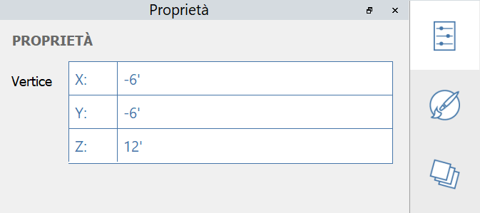
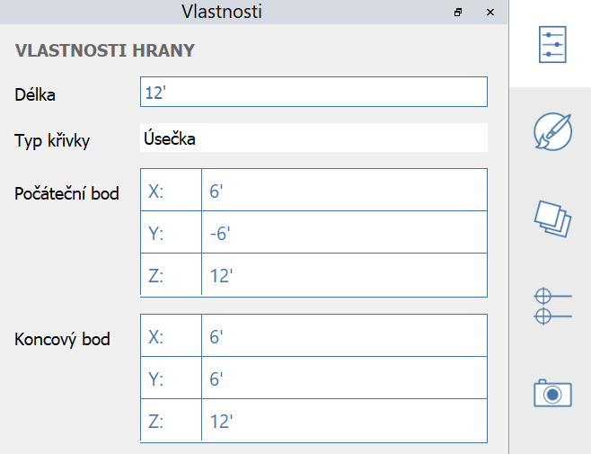

# Proprietà

Nella **tavolozza Proprietà** vengono visualizzate le informazioni e i dati relativi ad un oggetto selezionato nel piano di lavoro di FormIt.

Utilizzando la tavolozza Proprietà, è possibile modificare il gruppo di un oggetto, assegnare un oggetto ad un layer e modificare il materiale di un oggetto.

## Modifica dalla tavolozza Proprietà.

In FormIt 2023 e versioni successive, è possibile modificare le proprietà di un vertice, un bordo, una superficie e un volume mediante la tavolozza Proprietà:

#### Proprietà del vertice modificabili:

<figure><figcaption></figcaption></figure>

#### Proprietà del bordo modificabili:

<figure><figcaption></figcaption></figure>

#### Proprietà della superficie modificabili:

<figure><figcaption></figcaption></figure>

#### Proprietà del solido modificabili:

<figure><figcaption></figcaption></figure>
