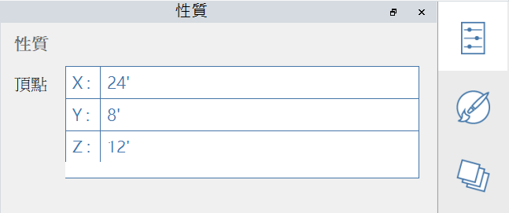

# Propriedades

A **paleta Propriedades** exibe informações e dados relevantes para um objeto selecionado no Plano de trabalho do FormIt.

Usando a paleta Propriedades, é possível editar o grupo de um objeto, atribuir um objeto a uma camada e alterar o material de um objeto.

## Editar na paleta Propriedades

No FormIt 2023 e versões mais recentes, é possível modificar as propriedades de um vértice, de uma aresta, de uma face e de um volume usando a paleta Propriedades:

#### Propriedades de vértice editáveis:

<figure><figcaption></figcaption></figure>

#### Propriedades de aresta editáveis:

<figure><figcaption></figcaption></figure>

#### Propriedades de face editáveis:

<figure><figcaption></figcaption></figure>

#### Propriedades de sólido editáveis:

<figure><figcaption></figcaption></figure>
