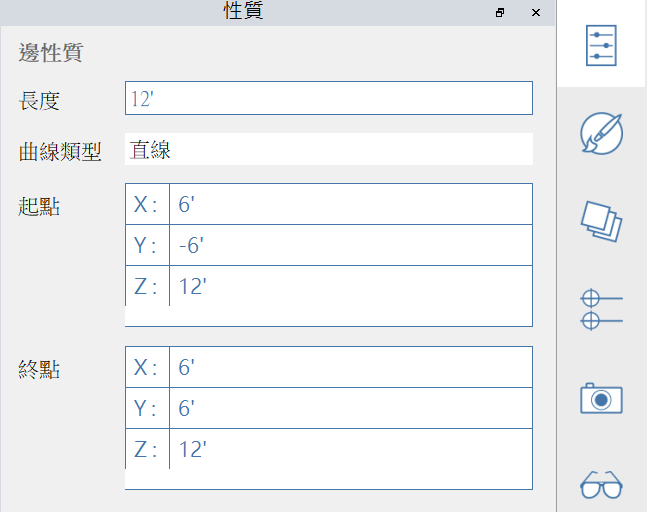

# Свойства

На **палитре свойств** отображаются сведения и данные, относящиеся к выбранному объекту в рабочей плоскости Formit.

С помощью палитры свойств можно редактировать группу объекта, назначать объект слою и изменять материал объекта.

## Операция редактирования из палитры свойств

В FormIt 2023 или более поздней версии можно изменять свойства вершины, ребра, грани и объема с помощью палитры свойств.

#### Редактируемые свойства вершин:

<figure><figcaption></figcaption></figure>

#### Редактируемые свойства ребер:

<figure><figcaption></figcaption></figure>

#### Редактируемые свойства граней:

<figure><figcaption></figcaption></figure>

#### Редактируемые свойства тел:

<figure><figcaption></figcaption></figure>
