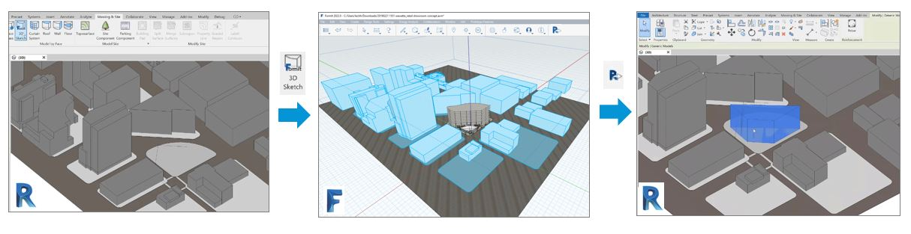

# Revit

FormIt has been designed to work well with Revit. To learn more about the basics, refer to [**this section in the FormIt Primer tutorial**](revit.md).

## Working with data from Revit

You can send geometry from Revit to FormIt. This is useful for doing quick study models and then sending geometry back to Revit.

Import a FormIt object to Revit by using the Import CAD button on the Insert tab in Revit and selecting an .axm file. Make edits, and then use the 3D Sketch button on the Massing & Site tab to open the model in FormIt. This is available from 3D views only.

Choose to bring all visible objects or just selected objects into FormIt. Choosing to bring only selected objects is helpful if the Revit model is large and the design will reference only a portion of the Revit model.

Model in FormIt by adding forms or applying levels, materials, content, and more.

You can choose to include or exclude objects to send to Revit in the Layers palette. When you’re ready to send your updates back to Revit, you can do so easily with the Send to Revit button.

The first time you do this, you’ll be prompted to save the sketch. This creates a link between FormIt and Revit, and you’ll be able to send subsequent edits to Revit by either resaving the file or using the Send to Revit button.

Here is a [video demonstration](https://youtu.be/yFTMI3V-v1Y).
