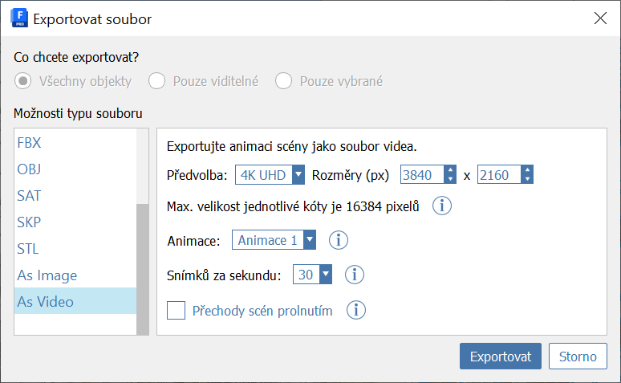

# Scenes

Use scenes and animations to help you steer walkthroughs and tell a visual story. You can save a scene viewpoint and its related visual and layer states. Add an animation and nest scenes under it to modify transitions, pauses, and camera speed.

### Create a scene:

* In the Scenes palette, click  to add a scene.
* While the scene is selected, you can edit its properties at the bottom of the Scenes palette. Update the scene by clicking.
* To edit animation cameras, click .
  1. In this mode, you can change the camera position and direction by clicking and dragging the gray circles.
  2. Reset the camera position to be behind your viewpoint by clicking .
* Double-click a scene to view it.
* To reorder scenes, click and drag them up and down.

### Create an animation:

* Click  to add an animation.
* Click  and add at least two scenes inside the animation.
* Set up each scene by following the “To create a scene” directions above.
  1. You can choose to include or exclude a scene from the animation by using the Include in Playback checkbox under Scene Properties.
* Edit pause time, transition time, and camera speed by using the controls under Scene Properties.
* View your animation by clicking .

### Export an animation:

* Open the File menu and select Export. You can choose to export to your local device or to Autodesk Docs.
* In the Export File dialog, scroll down in the File Type Options panel and select As Video.
* You can change various settings of the video file in this dialog.
  1. Select the Blend Scene Transitions option to blend frames between scenes that use different visual styles or layers. This option is great for animations that focus more on layer states or visual styles rather than camera movement.
* When you're ready, use the Export button, enter a file name and save location, and click Save.

