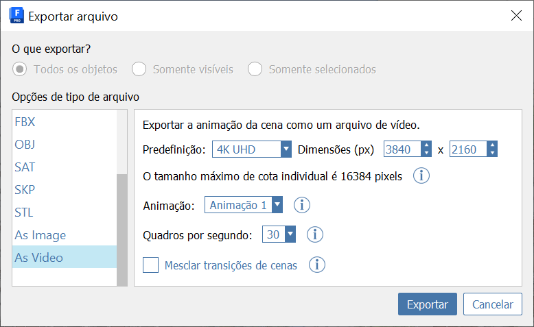

# Szenen

Verwenden Sie Szenen und Animationen, um Walkthroughs zu steuern und visuell anschauliche Präsentationen zu erstellen. Sie können einen Ansichtspunkt einer Szene und die zugehörigen visuellen und Layer-Status speichern. Fügen Sie eine Animation hinzu, und verschachteln Sie Szenen darunter, um Übergänge, Pausen und die Kamerageschwindigkeit zu ändern.

### Erstellen Sie eine Szene:

* Klicken Sie in der Palette Szenen auf , um eine Szene hinzuzufügen.
* Während die Szene ausgewählt ist, können Sie die Eigenschaften unten in der Palette Szenen bearbeiten. Aktualisieren Sie die Szene durch einen Klick auf.
* Um Animationskameras zu bearbeiten, klicken Sie auf .
   1. In diesem Modus können Sie die Kameraposition und -richtung ändern, indem Sie auf die grauen Kreise klicken und diese ziehen.
   2. Setzen Sie die Kameraposition zurück, sodass sie hinter dem Ansichtspunkt liegt. Klicken Sie dazu auf .
* Doppelklicken Sie auf eine Szene, um sie anzuzeigen.
* Um Szenen neu anzuordnen, klicken Sie auf die Szenen und ziehen sie nach oben und unten.

### Animation erstellen:

* Klicken Sie auf , um eine Animation hinzuzufügen.
* Klicken Sie auf , und fügen Sie mindestens zwei Szenen in der Animation hinzu.
* Richten Sie jede Szene ein, indem Sie die Anweisungen oben unter So erstellen Sie eine Szene befolgen.
   1. Sie können eine Szene in die Animation ein- oder ausschließen, indem Sie das Kontrollkästchen In Wiedergabe einschließen unter Szeneneigenschaften aktivieren.
* Bearbeiten Sie die Pausenzeit, die Übergangszeit und die Kamerageschwindigkeit mithilfe der Steuerelemente unter Szeneneigenschaften.
* Klicken Sie zum Anzeigen der Animation auf .

### Exportieren einer Animation:

* Öffnen Sie das Menü Datei, und wählen Sie Exportieren. Sie können den Export auf Ihr lokales Gerät oder in Autodesk Docs durchführen.
* Führen Sie im Dialogfeld Datei exportieren in der Gruppe Dateitypoptionen einen Bildlauf nach unten durch, und wählen Sie Als Video aus.
* In diesem Dialogfeld können Sie verschiedene Einstellungen der Videodatei ändern.
   1. Wählen Sie die Option Szenenübergänge verschmelzen, um Frames zwischen Szenen mit unterschiedlichen visuellen Stilen oder Layern zu verschmelzen. Diese Option eignet sich besonders für Animationen, die sich mehr auf die Layerstatus oder visuelle Stile konzentrieren als auf die Kamerabewegung.
* Wenn Sie fertig sind, verwenden Sie die Schaltfläche Exportieren, geben einen Dateinamen und Speicherort ein und klicken auf Speichern.

