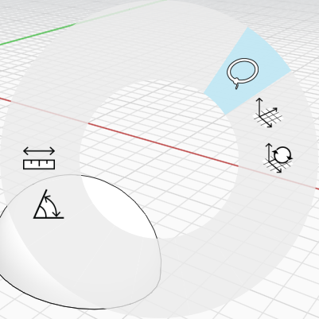

# Auswahl

## Direkte Auswahl

Zum **Auswählen eines Scheitelpunkts, einer Kante oder Fläche** bewegen Sie den Mauszeiger über das Objekt und klicken einmal, um es auszuwählen.

Um **ein ganzes Objekt** oder ein Objekt und alle verknüpften Elemente auszuwählen, doppelklicken Sie auf das Objekt.

Sie können auch die STRG- oder UMSCHALTTASTE gedrückt halten und Elemente zur aktuellen Auswahl hinzufügen oder daraus entfernen.

## Auswahlfilterung

Für die Flächen- oder Lasso-Auswahl (siehe unten) können Sie die Auswahl nach Typ filtern.

Dies ist besonders nützlich, wenn verschiedene Geometrietypen nahe beieinander liegen und Sie die Flächen- oder Lasso-Auswahl verwenden möchten, um ein breites Netz zu werfen, aber nur einen bestimmten Geometrietyp erhalten möchten, während andere ausgeschlossen werden sollen.

.png>)

## Flächen-/Fensterauswahl

Zur **Auswahl mehrerer Geometrieobjekte auf einmal** verwenden Sie die Fensterauswahl. Stellen Sie sicher, dass nichts ausgewählt ist. Klicken Sie dann, und ziehen Sie die Maus entweder von links nach rechts oder von rechts nach links, um mehrere Objekte zu erfassen.

## Lasso-Auswahl

Verwenden Sie das Lassowerkzeug, wenn Sie mehrere Geometrieobjekte mit **größerer Präzision** auswählen möchten. Es steht im Kontextmenü zur Verfügung, das Sie durch Rechtsklicken im leeren Arbeitsbereich aufrufen. Zeichnen Sie dann eine Begrenzung um den gewünschten Auswahlbereich.

\

