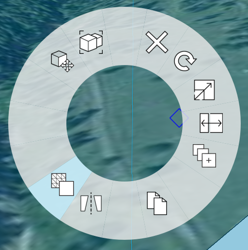
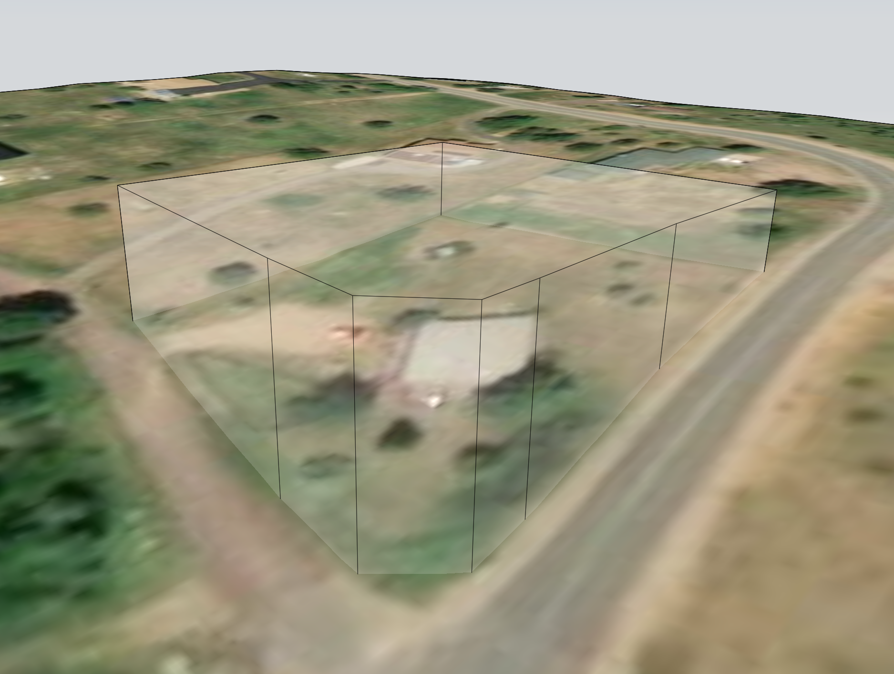
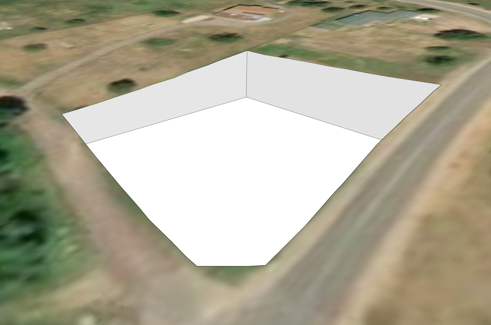

# Impostazione della posizione

Impostare la posizione del progetto nel mondo è importante per la precisione del modello e delle analisi a valle, incluso quanto segue:

* La posizione viene utilizzata per importare un'immagine satellitare che può essere utilizzata per tracciare una planimetria o un edificio esistente.
* La posizione viene utilizzata per importare il terreno 3D, che può essere utilizzato per fare riferimento ai dati topologici per una planimetria.
* La posizione viene utilizzata per posizionare in modo preciso il sole nel cielo, influenzando il calcolo delle ombre.
* La posizione viene utilizzata per l'analisi solare e l'analisi energetica per fornire calcoli analitici accurati.

Per accedere alla finestra di dialogo Imposta posizione e ai relativi servizi, è necessario accedere con Autodesk Account.

### Introduzione alla posizione

* Avviare la finestra di dialogo **Imposta posizione** dallo strumento **Posizione** sulla barra degli strumenti o con i tasti di scelta rapida SL.

.png>)

* Iniziare digitando la posizione del progetto nella casella di ricerca nell'angolo superiore sinistro della finestra _Imposta posizione_.&#x20;

.png>)

* Selezionare una delle opzioni di composizione automatica della posizione oppure premere INVIO per scegliere la prima opzione.
* Verrà eseguito lo zoom avanti della posizione cercata automaticamente.

### Imposta solo posizione e Importa immagine satellitare e terreno

Dopo aver cercato una posizione, è possibile scegliere una delle due opzioni:

* **Imposta solo posizione** consente di impostare la posizione nel file senza importare immagini satellitari.
* **Importa immagine satellitare e terreno** consente di impostare la posizione e anche di importare immagini satellitari e terreno utilizzando un livello di zoom e le estensioni configurabili.

### Importazione di immagini satellitari

* Fare clic su **Importa immagine satellitare e terreno** nella parte superiore destra della finestra **Imposta posizione**.
* Al centro della finestra viene visualizzata un'anteprima delle immagini satellitari, insieme ad un'indicazione della posizione dell'origine di FormIt rispetto alle immagini.

* Trascinare le immagini satellitari all'interno del quadrato per regolarne la posizione.
* Una volta che l'area quadrata ha incapsulato le immagini desiderate, fare clic su **Termina importazione dell'immagine**.
* L'immagine verrà importata in scala, con il nord reale rivolto verso l'alto, centrato in corrispondenza dell'origine dell'area di disegno di FormIt. È possibile modificare la trasparenza e l'ordinamento Z dell'immagine importata facendo doppio clic e accedendo alla [**tavolozza Proprietà**](../formit-introduction/tool-bars.md).&#x20;

### Aggiornamento di immagini satellitari

Dopo aver importato per la prima volta immagini satellitari, è possibile utilizzare la finestra Imposta posizione per regolare il livello di zoom o le estensioni delle immagini satellitari.

* Avviare nuovamente la finestra **Imposta posizione** accedendo dalla finestra dalla barra degli strumenti, come descritto in precedenza.
* Fare clic su **Importa immagine satellitare e terreno.**
* Verranno visualizzati il livello di zoom e le estensioni dell'immagine satellitare corrente, come mostrato nell'area di disegno di FormIt.
* È sufficiente regolare la posizione o lo zoom e fare clic su **Termina importazione dell'immagine** come in precedenza.
* Quando l'immagine viene reimportata nell'area di disegno, verrà spostata nella posizione corretta rispetto alla posizione originale (e potrebbe non essere più centrata in corrispondenza dell'origine):

### Importazione del terreno

Novità di FormIt 2021.3: quando si utilizza la finestra di dialogo **Imposta posizione** per importare immagini satellitari, verrà incluso anche il terreno.

Quando il terreno viene importato, viene posizionato su un layer, che è disattivato per default (nel caso in cui sia stata avviata la modellazione, il modello potrebbe essere coperto dal terreno).

Quando si è pronti per visualizzare il terreno, attivare o disattivare il layer Terrain selezionando la casella:

 (1).png>)

### Utilizzo di Terrain

Terrain verrà posizionato in un gruppo di FormIt. Fare doppio clic sul gruppo per modificarlo.

All'interno sono disponibili due mesh: una per i lati e la parte inferiore e una per la parte superiore.

Se si desidera modificare il terreno, è necessario convertire le mesh in un singolo oggetto solido:

* Selezionare entrambe le mesh.
* Fare clic con il pulsante destro del mouse e scegliere l'opzione Mesh in oggetti oppure utilizzare il tasto di scelta rapida MO.

Quando si convertono contemporaneamente entrambe le mesh in un oggetto, FormIt può combinarle in un oggetto solido manifold, che può essere utilizzato per operazioni su solidi come il taglio booleano.

Da qui, è possibile utilizzare una combinazione di [Vista dall'alto](orthographic-views.md) e della vista della [cinepresa Ortogonale](orthographic-camera.md) per tracciare il contorno della planimetria su un piano orizzontale, quindi estrudere il piano in un volume che interseca il terreno. L'utilizzo di un [materiale](materials.md) trasparente aiuta a vedere il terreno attraverso il solido di taglio:

Utilizzare lo strumento Taglia geometria e selezionare il terreno come solido in cui eseguire il taglio e il volume di taglio come solido da rimuovere.

Il risultato sarà il terreno con il solido di taglio rimosso, che espone il vuoto in cui è possibile disegnare la nuova planimetria e la nuova fondazione.

È possibile utilizzare i [layer](layers.md) per nascondere il solido di taglio o anche per creare copie del terreno con e senza il taglio, nel caso in cui sia necessario fare riferimento al terreno originale o modificare la forma di taglio prima di eseguire l'operazione di taglio del solido.

### Risoluzione dei problemi della finestra di dialogo Imposta posizione

L'impostazione di una posizione in FormIt richiede una connessione ad Internet per scaricare i dati satellitari e del terreno da Bing Maps.

Inoltre, poiché la finestra di dialogo Imposta posizione è come un plug-in di FormIt, richiede l'accesso a GitHub per poter funzionare. Se si verificano problemi con la finestra di dialogo Imposta posizione, verificare di disporre dell'accesso a [https://github.io](https://github.io):&#x20;

* Accedere al browser Web.
* Provare ad accedere a [https://formit3d.github.io/SetLocationPlugin/v20\_0/manifest.json](https://formit3d.github.io/SetLocationPlugin/v20\_0/manifest.json).
* Se alcuni dati non vengono visualizzati, è possibile che la rete o il firewall blocchi l'accesso a GitHub.
