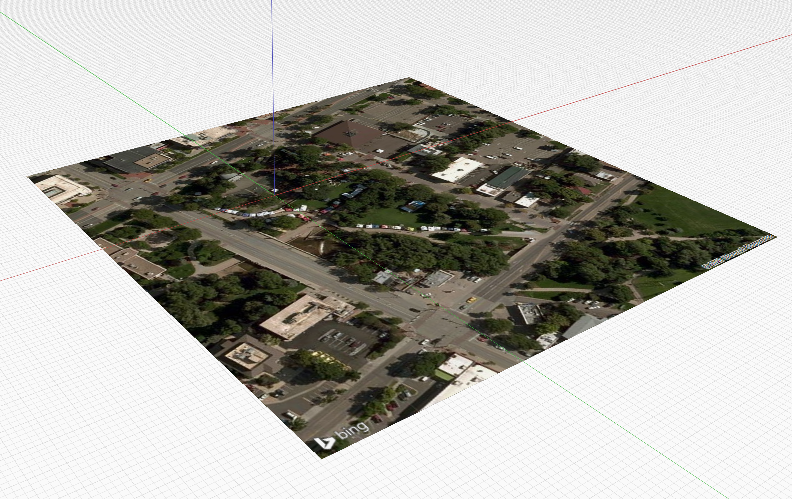

# 设置位置

设置项目在世界上的位置对模型和下游分析的准确性至关重要，包括：

* 位置用于输入卫星图像，该图像可用于跟踪现有场地或建筑。
* 位置用于输入三维地形，该地形可用于参照场地的拓扑数据。
* 位置用于精确定位天空中的太阳，从而影响阴影的计算。
* 位置用于日光分析和能量分析，以提供精确的分析计算。

您需要使用 Autodesk 帐户登录，才能访问“设置位置”对话框及其服务。

### 位置快速入门

* 从工具栏中的 **“位置”** 工具或使用键盘快捷键 SL，启动 **“设置位置”** 对话框。

.png>)

* 首先，在 _“设置位置”_ 窗口左上角的搜索框中，键入项目的位置。&#x20;

.png>)

* 选择自动填充位置选项之一，或点击 Enter 键选择第一个选项
* 您将自动放大到搜索的位置

### “仅设置位置”与“输入卫星图像和地形”

搜索到位置后，可以选择以下两个选项之一：

* **“仅设置位置”** 将在文件中设置位置，而不输入卫星图像。
* **“输入卫星图像和地形”** 将设置位置，还将使用可配置的缩放级别和范围输入卫星图像和地形。

### 输入卫星图像

* 单击 **“设置位置”** 窗口右上角的 **“输入卫星图像和地形”** 。
* 卫星图像的预览将显示在窗口的中心，并指示 FormIt 原点相对于图像的显示位置。

* 拖动方框内的卫星图像以调整其位置
* 在方形区域封装所需图像后，单击 **“完成输入”**
* 图像将按比例输入，正北朝上，以 FormIt 画布原点为中心。通过双击输入的图像并转到[**“特性选项板”**](../formit-introduction/tool-bars.md)，即可更改该图像的透明度和 Z 轴顺序。&#x20;

### 更新卫星图像

首次输入卫星图像后，可以使用“设置位置”窗口调整卫星图像的缩放级别或范围。

* 通过工具栏访问 **“设置位置”** 窗口，将再次启动该窗口，如上所述。
* 单击 **“输入卫星图像和地形”。**
* 您将看到当前卫星图像的缩放级别和范围，如 FormIt 画布中所示
* 只需调整位置或缩放，然后像之前一样单击 **“完成输入”**
* 将图像重新输入到画布后，它将移动到相对于原始图像位置的正确位置（可能不再以原点为中心）：

### 输入地形

FormIt 2021.3 中的新增功能，当使用 **“设置位置”** 对话框输入卫星图像时，您还将获得地形。

输入地形后，它将放置在图层上，默认情况下处于禁用状态（如果已开始建模，则模型可能遭地形覆盖）。

当准备查看地形时，请通过选中该框来切换“地形”图层：

 (1).png>)

### 使用地形

地形将放置“FormIt”组中。双击该组以对其进行编辑。

在内部，将找到两个网格：一个用于侧面和底面，一个用于顶面。

如果要修改地形，需要将网格转换为单个实体对象：

* 选择两个网格
* 单击鼠标右键，然后选择“网格到对象”选项，或使用快捷键 MO

同时将两个网格转换为对象时，FormIt 可以将它们合并为一个实体的流形对象，该对象可用于“布尔切割”等实体操作。

在此处，可以组合使用[“俯视图”](orthographic-views.md)和[“正交相机”](orthographic-camera.md)以跟踪水平面上的场地边界，然后将该平面拉伸为与地形相交的体积。使用透明[材质](materials.md)有助于您通过剪切实体查看地形：

使用“剪切几何图形”工具、选择地形作为“要剪切到的实体”，然后选择剪切体积作为“要删除的实体”。

结果将为剪切实体已删除的地形，从而显示可以绘制新场地和基础的空区域。

可以使用[图层](layers.md)隐藏剪切实体，甚至可以创建带和不带剪切的地形副本，以防需要参照原始地形，或在执行实体剪切操作之前更改剪切形状。

### “设置位置”对话框疑难解答

在 FormIt 中设置位置需要连接 Internet，以从必应地图下载卫星和地形数据。

此外，由于“设置位置”对话框是后台的 FormIt 插件，因此它需要访问 GitHub 才能起作用。如果在使用“设置位置”对话框时遇到问题，请检查您是否有权访问 [https://github.io](https://github.io)：

* 转到 Web 浏览器。
* 尝试导航到 [https://formit3d.github.io/SetLocationPlugin/v20\_0/manifest.json](https://formit3d.github.io/SetLocationPlugin/v20\_0/manifest.json)
* 如果您未看到某些数据显示，则您的网络或防火墙可能正在阻止对 GitHub 的访问。
