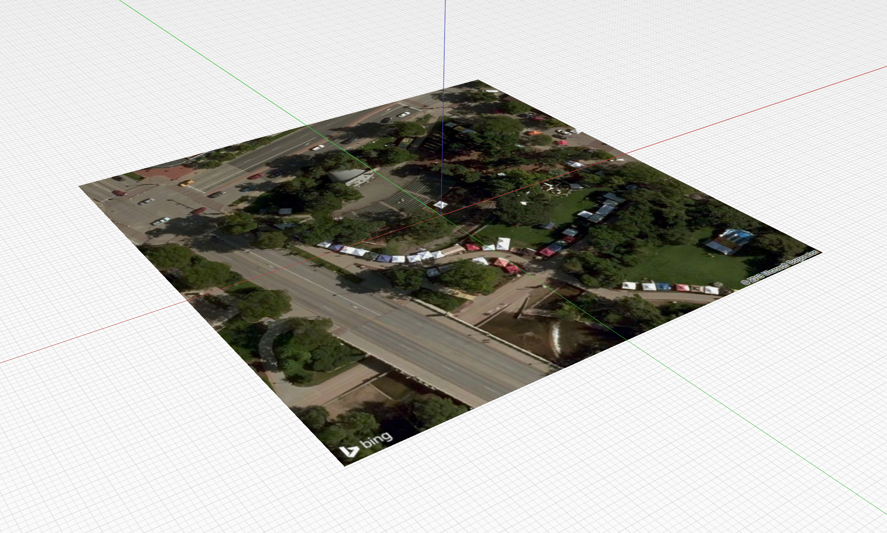

# Definir a localização

Definir a localização de seu projeto no mundo é importante para a precisão do modelo e análises posteriores, incluindo:

* A localização é usada para importar uma imagem de satélite que pode ser usada para traçar um terreno ou construção existente.
* A localização é usada para importar um terreno 3D, que pode ser usado para referenciar dados topológicos para um terreno.
* A localização é usada para posicionamento preciso do sol no céu, afetando o cálculo de sombras.
* A localização é usada para a análise solar e a análise de energia para fornecer cálculos analíticos precisos.

Você precisará estar conectado com a Autodesk Account para acessar a caixa de diálogo Configurar localização e seus serviços.

### Introdução à localização

* Abra a caixa de diálogo **Configurar localização** da ferramenta **Localização** na barra de ferramentas ou com o atalho de teclado SL.

.png>)

* Comece digitando a localização do projeto na caixa de pesquisa no canto superior esquerdo da janela _Configurar localização_.&#x20;

.png>)

* Selecione uma das opções de localização de preenchimento automático ou pressione Enter para escolher a primeira
* Você aumentará o zoom na localização que pesquisou automaticamente

### Definir somente localização versus Importar imagem de satélite e terreno

Após ter pesquisado uma localização, você pode escolher uma das duas opções:

* **Definir somente localização** definirá a localização no arquivo sem importar as imagens de satélite.
* **Importar imagem de satélite e terreno** definirá a localização e também importará imagens de satélite e terreno usando um nível de zoom e extensões que você pode configurar.

### Importar imagens de satélite

* Clique em **Importar imagem de satélite e terreno** na parte superior direita da janela **Definir localização**.
* Uma visualização das imagens de satélite será exibida no centro da janela, junto com uma indicação de onde a origem do FormIt será exibida, relativa às imagens.

* Arraste as imagens de satélite dentro do quadrado para ajustar sua posição
* Depois que a área quadrada encapsula as imagens desejadas, clique em **Concluir importação**
* A imagem será importada em escala, com o norte verdadeiro voltado para cima, centralizado na origem da tela do FormIt. É possível alterar a transparência e a ordem Z da imagem importada clicando duas vezes nela e acessando a [**paleta Propriedades**](../formit-introduction/tool-bars.md).&#x20;

### Atualizar as imagens de satélite

Após importar imagens de satélite pela primeira vez, é possível usar a janela Configurar localização para ajustar o nível de zoom ou as extensões das imagens de satélite.

* Inicie a janela **Configurar localização** novamente acessando-a na barra de ferramentas, como descrito acima.
* Clique em **Importar imagem de satélite e terreno.**
* Você verá o nível de zoom e as extensões da imagem de satélite atual, como mostrado na tela do FormIt
* Basta ajustar a posição ou o zoom e clicar em **Concluir importação** como você fez antes
* Quando a imagem for reimportada para a tela, ela se moverá para a localização correta relativa à posição original da imagem (e não poderá mais ser centralizada na origem):

### Importar terreno

Novo no FormIt 2021.3, quando você usa a caixa de diálogo **Configurar localização** para importar imagens de satélite, também obterá o terreno.

Quando o terreno é importado, ele é colocado em uma camada, que está desativada por padrão (caso você tenha iniciado a modelagem, o modelo poderá ser coberto pelo terreno).

Quando estiver pronto para visualizar o terreno, alterne a camada do terreno marcando a caixa:

 (1).png>)

### Trabalhar com o terreno

O terreno será colocado em um grupo do FormIt. Clique duas vezes no grupo para editá-lo.

Dentro ele, você encontrará duas malhas: uma para os lados e a parte inferior e outra para a parte superior.

Se você desejar modificar o terreno, será necessário converter as Malhas em um único objeto sólido:

* Selecione ambas as malhas.
* Clique com o botão direito do mouse e escolha a opção Malhas em objetos ou use o atalho MO.

Ao converter ambas as malhas em um objeto ao mesmo tempo, o FormIt poderá combiná-las em um objeto sólido e múltiplo, que poderá ser usado para operações de sólido, como Corte booleano.

Daqui, é possível usar uma combinação de [Vista superior](orthographic-views.md) e [Câmera ortogonal](orthographic-camera.md) para traçar o limite do terreno em um plano horizontal e, em seguida, efetuar a extrusão do plano em um volume que efetua a interseção com o terreno. Usar um [material](materials.md) transparente ajudará a visualizar o terreno por meio do sólido de corte:

Use a ferramenta Cortar geometria e selecione o terreno como o “Sólido a ser cortado” e o volume de corte como “Sólido a ser removido”.

O resultado será o terreno com o sólido de corte removido, expondo o vazio onde é possível desenhar o novo terreno e fundação.

É possível usar [camadas](layers.md) para ocultar o sólido de corte, ou até mesmo fazer cópias do terreno com e sem o corte, caso seja necessário referenciar o terreno original, ou alterar a forma de corte antes de executar a operação de corte sólido.

### Solução de problemas da caixa de diálogo Configurar localização

A definição de uma localização no FormIt requer uma conexão com a Internet para fazer o download de dados de satélite e terreno do Bing Maps.

Além disso, como a caixa de diálogo Configurar localização é estruturalmente um plug-in do FormIt, ele requer acesso ao GitHub para funcionar. Se você estiver tendo problemas com a caixa de diálogo Configurar localização, verifique se tem acesso a [https://github.io](https://github.io):&#x20;

* Vá para o navegador da Web.
* Tente navegar para [https://formit3d.github.io/SetLocationPlugin/v20\_0/manifest.json](https://formit3d.github.io/SetLocationPlugin/v20\_0/manifest.json)
* Se você não vir a exibição de alguns dados, a rede ou o firewall poderá estar bloqueando o acesso ao GitHub.
