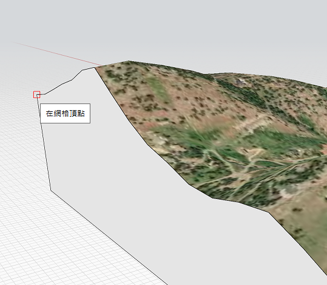

# Przyciąganie i wnioskowanie

Aby łatwiej szkicować i modelować, używaj przyciągania i punktów wnioskowania w celu dokładnego tworzenia, umieszczania i edytowania geometrii. Można używać dowolnej osi jako tej, na podstawie której będzie coś rysowane lub zostanie wykonana inna operacja, np. wyciągnięcie powierzchni.

**Uwaga:** _Zobacz temat_ [_Skróty klawiaturowe_](../appendix/keyboard-shortcuts.md)_, aby uzyskać informacje na temat przyspieszenia korzystania z narzędzi oprogramowania._

## Przyciąganie

Istnieje kilka trybów przyciągania, które mogą być pomocne podczas szkicowania i modelowania. Przyciąganie do obiektów jest automatycznie włączone i można je przyciągać do następujących elementów:

|                                                                                                                                                                            |                                        |
| -------------------------------------------------------------------------------------------------------------------------------------------------------------------------- | -------------------------------------- |
| Wierzchołki | .png>) |
| krawędzi Po ustawieniu wskaźnika na krawędzi na końcach i w punkcie środkowym zostaną narysowane małe czerwone kropki. |  |
| Punkty środkowe krawędzi |  |
| Płaszczyzna powierzchni. Po ustawieniu wskaźnika na powierzchni na środku ciężkości powierzchni zostanie narysowana mała czerwona kropka. Ułatwi to znalezienie tego punktu, jeśli chcesz do niego przyciągnąć. |  |
| Środki ciężkości powierzchni |  |
| Płaszczyzna robocza, jeśli nie przyciągniesz do niczego innego. |  |
| Środki okręgów lub łuków |  |
| Wierzchołki siatki |  |
| Płaszczyzna fasety siatki. |  |

Aby przyciągnąć do siatki, należy włączyć przełącznik **Przyciągaj do siatki (SG)** w menu Ustawienia.

## Punkty i osie wnioskowania

Automatyczny wybór punktów wnioskowania jest zawsze włączony i pomaga ograniczyć ruch geometrii. Osie wnioskowania są generowane za pomocą narzędzi automatycznie lub po umieszczeniu wskaźnika myszy na krawędziach bądź punktach. Osie wnioskowania są zawsze rysowane na ekranie za pomocą kresek, dzięki czemu użytkownik wie, gdzie się znajdują, i można łatwo do nich przyciągać.

**Oś:** Geometrię można przesuwać wzdłuż osi X, Y lub Z. Oś wnioskowania X ma kolor czerwony, oś Y zielony, a oś Z niebieski.

**Blokowanie osi:** Ruch można blokować wzdłuż osi X, Y lub Z. Przy wskaźniku znajdującym się na osi wnioskowania przytrzymaj klawisz Shift, a następnie przesuń mysz, aby przyciągnąć i wnioskować w zakresie innych elementów.

**Równoległe:** Geometrię można szkicować lub przesuwać równolegle do istniejących elementów. Wnioskowania prostopadłe są fioletowe. Należy umieścić kursor na linii, która ma służyć jako odniesienie równoległe.

**Prostopadłe:** Można również rysować lub przesuwać geometrię prostopadle do istniejących elementów. Wnioskowania prostopadłe są fioletowe. Należy umieścić kursor na linii, która ma służyć jako odniesienie prostopadłe.

**Wydłużanie od punktu:** Można również używać odniesień, aby wydłużać od punktu odniesienia. Ustaw wskaźnik myszy na punkcie, który ma służyć jako odniesienie, i poczekaj, aż zostanie wyświetlona etykieta narzędzia, a następnie użyj osi wnioskowania, która rozciąga się od tego punktu.

**Środek okręgu**: Aby przyciągnąć do środka łuku lub okręgu, ustaw kursor na łuku lub okręgu. Spowoduje to wyświetlenie małej czerwonej kropki w środku. Po odsunięciu kursora od łuku lub okręgu będzie ona widoczna przez około 5 sekund. Teraz przesuń kursor na czerwoną kropkę, aby przyciągnąć do środka.

**Rzeczywiste punkty środkowe łuku i splajnu**: Po umieszczeniu wskaźnika myszy na okręgu, łuku lub splajnie można przyciągać do rzeczywistego punktu środkowego. Ten punkt i punkty końcowe będą wskazywane za pomocą małej czerwonej kropki. Podczas wnioskowania na łuku można również przyciągać do wierzchołków krawędzi prostych, które reprezentują łuk.

**Czyszczenie elementów wnioskowania**: Może się zdarzyć, że wskutek rysowania zostanie wygenerowana duża liczba elementów wnioskowania, co może przeszkadzać w umieszczaniu punktów, które nie powinny być przyciągane do tych elementów. Naciśnięcie klawiszy **Shift + Spacja** spowoduje usunięcie wszystkich elementów wnioskowania, z wyjątkiem tych znajdujących się w ostatnio umieszczonym punkcie.

