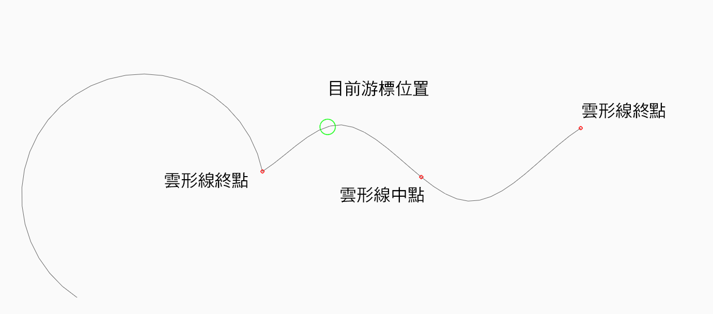

# Objektfang und Ableitungen

Objektfang und Ableitungspunkte ermöglichen eine präzise Erstellung, Platzierung und Bearbeitung von Geometrie und erleichtern dadurch das Skizzieren und Modellieren. Sie können die Achse wählen, entlang derer Sie zeichnen oder eine andere Funktion ausführen möchten, etwa das Extrudieren einer Oberfläche.

**Anmerkung:** _Unter_ [_Tastaturkurzbefehle_](../appendix/keyboard-shortcuts.md) _finden Sie Informationen dazu, wie Sie noch schneller mit den Werkzeugen der Software arbeiten können._

## Objektfang

Beim Skizzieren und Modellieren stehen mehrere Objektfangfunktionen zur Verfügung. Der Objektfang für Objekte ist automatisch aktiviert. Die folgenden Fangreferenzen sind verfügbar:

|                                                                                                                                                                            |                                        |
| -------------------------------------------------------------------------------------------------------------------------------------------------------------------------- | -------------------------------------- |
| Knoten | .png>) |
| Kanten Wenn Sie den Mauszeiger über die Kante bewegen, werden kleine        rote Punkte an den Enden und am Mittelpunkt gezeichnet. |  |
| Kantenmittelpunkte |  |
| Die Ebene einer Fläche. Wenn Sie den Mauszeiger über die Fläche bewegen, wird ein        kleiner roter Punkt am Flächenschwerpunkt gezeichnet. Dadurch können Sie den Punkt leicht finden,        wenn Sie diesen fangen möchten. |  |
| Flächenschwerpunkte |  |
| Die Arbeitsebene, wenn Sie kein anderes Element fangen. |  |
| Kreis- oder Bogenmittelpunkte |  |
| Netzscheitelpunkte |  |
| Die Ebene einer Netzfacette. |  |

Um den Objektfang am Raster zu verwenden, müssen Sie die Option **Rasterfang (SG)** aus dem Menü Einstellungen aktivieren.

## Ableitungsachsen und -punkte

Die automatische Auswahl für Ableitungspunkte ist immer aktiviert und unterstützt Sie dabei, die Bewegungsmöglichkeiten für Geometrie einzuschränken. Ableitungsachsen werden automatisch durch Werkzeuge generiert oder wenn Sie den Mauszeiger über Kanten oder Punkte bewegen. Ableitungsachsen werden immer mit Strichen auf dem Bildschirm gezeichnet, damit Sie wissen, wo sie sich befinden, und damit sie einfach gefangen werden können.

**Achse:** Sie können Geometrie entlang der X-, Y- oder Z-Achse verschieben. Die Ableitung für die X-Achse ist rot, für die Y-Achse grün und für die Z-Achse blau.

**Achse sperren:** Sie können die Bewegung entlang der X-, Y- oder Z-Achse sperren. Halten Sie die Umschalttaste gedrückt, während Sie eine Achsenableitung verwenden, und bewegen Sie die Maus, um den Objektfang und die Ableitung mit anderen Elementen als Referenzen zu verwenden.

**Parallel:** Sie können Geometrie parallel zu bestehenden Elementen skizzieren oder verschieben. Lotrechte Ableitungen sind violett. Sie müssen den Cursor auf die Linie setzen, die Sie als parallele Referenz verwenden möchten.

**Lotrecht:** Es ist auch möglich, Geometrie lotrecht zu bestehenden Elementen zu zeichnen oder zu verschieben. Lotrechte Ableitungen sind violett. Sie müssen den Cursor auf die Linie setzen, die Sie als lotrechte Referenz verwenden möchten.

**Von einem Punkt ausgehend:** Sie können auch von einer Punktreferenz ausgehende Ableitungen verwenden. Setzen Sie den Cursor auf den Punkt, den Sie als Referenz verwenden möchten, bis die QuickInfo angezeigt wird, und verwenden Sie die von diesem Punkt ausgehende Ableitungsachse.

**Kreismittelpunkt**: Wenn Sie den Mittelpunkt eines Bogens oder Kreises fangen möchten, bewegen Sie den Mauszeiger über den Bogen oder Kreis. Es wird ein kleiner roter Punkt in der Mitte angezeigt. Er bleibt noch etwa 5 Sekunden sichtbar, wenn Sie den Mauszeiger vom Bogen oder Kreis weg bewegen. Bewegen Sie den Cursor nun über den roten Punkt, um den Mittelpunkt zu fangen.

**Tatsächliche Bogen- und Spline-Mittelpunkte**: Wenn Sie den Mauszeiger über einen Kreis, Bogen oder Spline bewegen, können Sie den tatsächlichen Mittelpunkt fangen. Dieser und die Endpunkte werden durch einen kleinen roten Punkt dargestellt. Wenn Sie einen Bogen ableiten, werden auch die Scheitelpunkte der geraden Kanten, die den Bogen darstellen, gefangen.

**Löschen von Ableitungen**: Es ist möglich, dass in Zeichnungen eine größere Anzahl von Ableitungen generiert wird. Dies könnte beim Platzieren von Punkten, die diese Ableitungen nicht fangen sollen, stören. Wenn Sie die **UMSCHALTTASTE+LEERTASTE** drücken, werden alle Ableitungen gelöscht, mit Ausnahme derjenigen am zuletzt platzierten Punkt.

