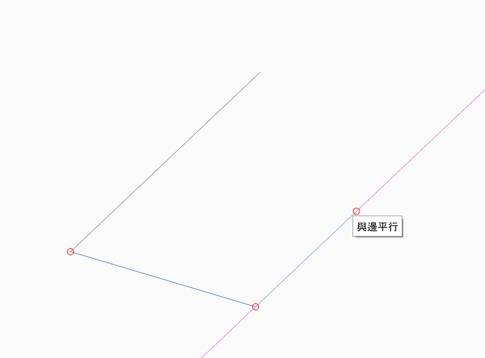

# Snaps e inferências

Para facilitar o esboço e a modelagem, use snaps e pontos de inferência para criar, inserir e editar a geometria com precisão. É possível usar qualquer eixo escolhido para desenhar ou executar outra ação, como a extrusão de uma superfície.

**Observação:** _Consulte_ [_Atalhos de teclado_](../appendix/keyboard-shortcuts.md) _para obter informações sobre como acelerar o uso das ferramentas do software._

## Posicionamento

Há vários snaps que poderão ajudar enquanto você estiver desenhando e modelando. O snap a objetos é automaticamente ativado. É possível efetuar snap a:

|                                                                                                                                                                            |                                        |
| -------------------------------------------------------------------------------------------------------------------------------------------------------------------------- | -------------------------------------- |
| Vértices | .png>) |
| Arestas. Ao passar o cursor sobre a aresta, pequenos pontos vermelhos serão desenhados nas extremidades e no ponto médio. |  |
| Pontos médios da aresta |  |
| O plano de uma face. Ao passar o cursor sobre a face, um pequeno ponto vermelho será desenhado no centroide da face. Isso facilitará a localização desse ponto, caso você deseje efetuar snap a ele. |  |
| Centroides de face |  |
| O plano de trabalho, se você não efetuar o snap a nenhuma outra coisa. |  |
| Centros de arco ou círculo |  |
| Vértices de malha |  |
| O plano de uma faceta de malha. |  |

Para efetuar o snap à grade, será necessário ativar a opção **Snap à grade (SG)** no menu Configurações.

## Eixos e pontos de inferência

A seleção automática de pontos de inferência sempre está ativada e ajudará a restringir o movimento da geometria. Os eixos de inferência são gerados por ferramentas automaticamente ou quando você passa o mouse sobre as arestas ou os pontos. Os eixos de inferência são sempre desenhados na tela com traços para que você saiba onde estão e para que seja fácil efetuar o snap.

**Eixo:** é possível mover a geometria ao longo do eixo X, Y ou Z. A inferência do eixo X é vermelho e o eixo Z é azul.

**Bloqueio de eixo:** é possível bloquear o movimento ao longo do eixo X, Y ou Z. Mantenha pressionada a tecla Shift enquanto estiver em uma inferência de eixo e, em seguida, mova o mouse para efetuar o snap e a inferência para outros elementos.

**Paralelo:** é possível desenhar ou mover a geometria paralela aos elementos existentes. As inferências perpendiculares são roxas. É necessário passar o cursor sobre uma linha que você deseja usar como referência paralela.

**Perpendicular:** também é possível desenhar ou mover a geometria perpendicular aos elementos existentes. As inferências perpendiculares são roxas. É necessário passar o cursor sobre uma linha que você deseja usar como referência perpendicular.

**Estender desde um ponto:** também é possível usar as inferências para estender desde uma referência de ponto. Passe o mouse sobre um ponto que você deseja usar como referência até que a dica de ferramenta seja exibida e, em seguida, use o eixo de inferência que se estende desde o ponto.

**Centro do círculo**: caso deseje efetuar o snap ao centro de um arco ou círculo, passe o cursor sobre o arco ou círculo. Isso mostrará um pequeno ponto vermelho no centro. Ele permanecerá visível por cerca de 5 segundos após você se afastar do arco ou círculo. Agora, mova o cursor sobre o ponto vermelho para efetuar o snap ao centro.

**Pontos médios de arco e spline verdadeiros**: quando você passar o cursor sobre um círculo, arco ou spline, será possível efetuar o snap ao ponto central verdadeiro. Ele e os pontos finais serão exibidos por um pequeno ponto vermelho. Ao inferir em um arco, você também efetuará o snap aos vértices das arestas retas que representam o arco.

**Limpar inferências**: é possível que o desenho gere um número maior de inferências, que pode estar na forma de colocar pontos que não devem efetuar o snap a essas inferências. Se você pressionar as teclas **Shift + barra de espaço**, todas as inferências serão apagadas, exceto as no último ponto inserido.

