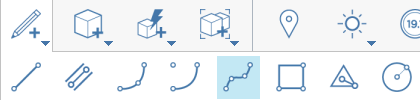
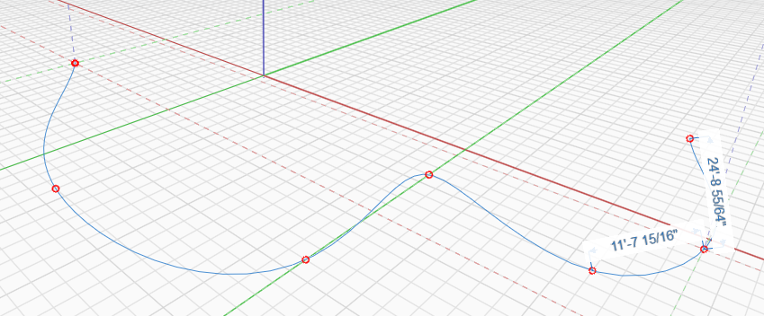
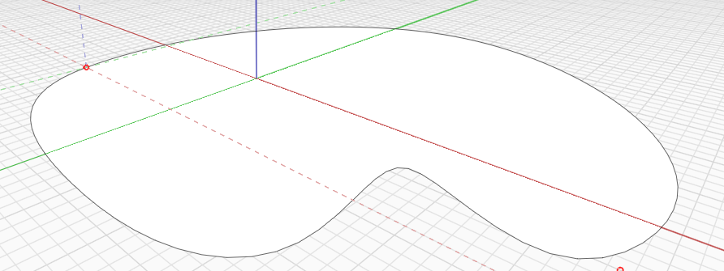

# Spline

Lo strumento Spline consente di creare disegni organici nello spazio o su altri oggetti.

Viene disegnata una spline da almeno 3 punti interpolati. La geometria connessa viene semplificata creando una curva uniforme e organica tra i punti specificati. Come altri strumenti di disegno, le spline possono essere disegnate in 3D mediante lo snap ai punti 3D durante il disegno.

Per specificare una distanza, iniziare a digitare un valore di quota e selezionare OK o premere INVIO nella finestra di dialogo Modifica quota.

Le spline possono anche chiudersi su se stesse creando una superficie.

## Modifica di una spline

È inoltre possibile modificare i punti di una spline già posizionata facendo clic con il pulsante destro del mouse e scegliendo Modifica spline nella parte inferiore:

<figure><figcaption></figcaption></figure>

Vengono visualizzati i grip di Modifica spline, che consentono di spostarli. La nuova spline verrà visualizzata come contorno durante la modifica.

<figure><figcaption></figcaption></figure>

Per completare la modifica, uscire dallo strumento facendo clic all'interno dello spazio o premendo ESC. La nuova spline sostituirà la spline corrente.
