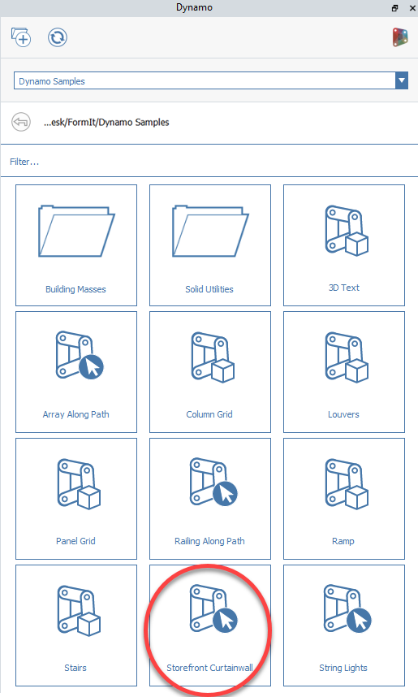
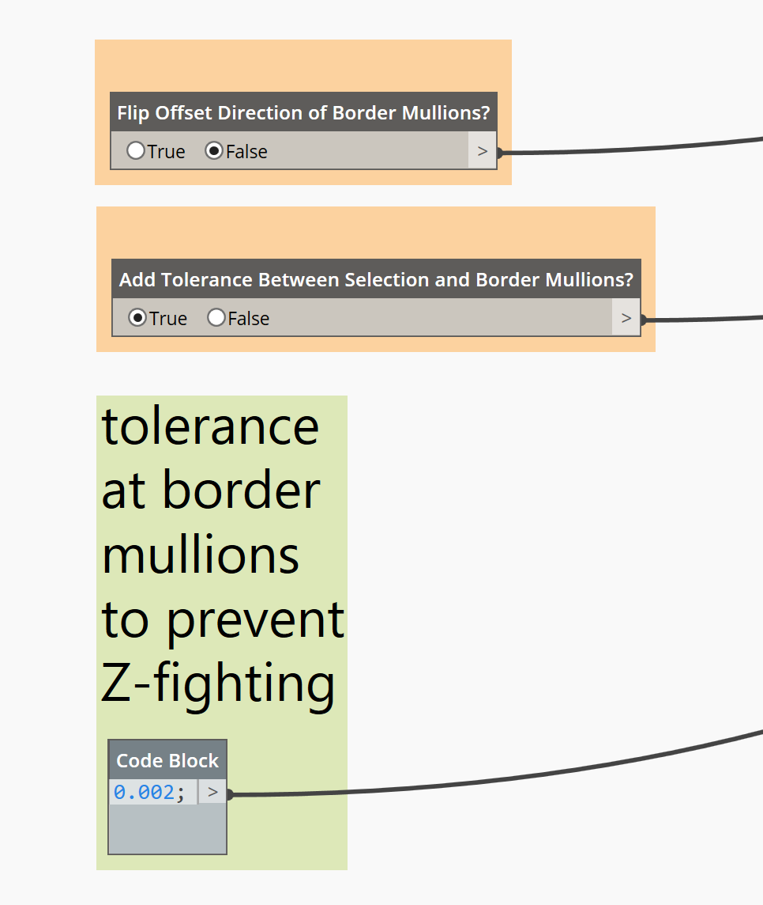

# Sistema de montante de vitrine/cortina parede

## Fornecido pelo Dynamo

A capacidade de criar rapidamente sistemas de montante de vitrine/cortina parede no FormIt é fornecida pelo Dynamo. É possível localizar o sistema Storefront Curtainwall no diretório Dynamo Samples no painel Dynamo:

## Selecionar “Glass” para o sistema do montante

A partir do FormIt 2021.2, o Sistema de vitrine/cortina parede usa o novo [nó SelectFromFormIt](https://formit.autodesk.com/page/formit-dynamo#dynamo-formit-nodes), permitindo que você selecione um pedaço de “vidro” (um sólido de face única ou de extrusão) em torno do qual será gerado um sistema de montante.

Quando você clicar na miniatura Vitrine/cortina parede (observe o ícone que indica que uma seleção é necessária), o FormIt solicitará que você selecione a geometria do vidro para continuar:

.png>)

Algumas notas e ressalvas sobre como funciona a seleção de vidro:

* No momento, somente superfícies planas são suportadas. Se você selecionar uma série de superfícies (por exemplo, uma superfície “curvada” composta de superfícies planas menores), o script encontrará a maior face plana e a usará.
* Se o vidro for sólido – ou seja, uma única face com extrusão muito pequena para transmitir um pouco de espessura – o script encontrará a maior superfície, de modo que os montantes resultantes serão gerados em um lado do sólido de vidro.
* É possível desenhar aberturas para portas e remover a superfície resultante do limite de vidro. Os montantes resultantes respeitarão a abertura da porta, deixando-a em branco para a adição de portas.
* Devido às limitações do Dynamo, esse script não funcionará se a geometria de vidro tiver aberturas no meio.

## Dicas e truques

Ao selecionar a geometria de um gráfico do Dynamo no FormIt, alguns truques organizacionais podem simplificar a experiência e permitir a instanciação fácil dos resultados:

* Coloque o vidro em um grupo e use o grupo como a seleção para o script Storefront/Curtainwall. Dessa forma, é mais fácil editar o perfil de vidro após os montantes terem sido gerados e, se o vidro for muito modificado entre os trechos e as IDs de face tiverem sido alteradas, o grupo garantirá que o script sempre encontre o vidro – porque ele está usando a ID de grupo, não a ID de face.
* Se você estiver planejando copiar e colar os resultados do sistema de montante em outros locais do modelo, será melhor ter o vidro e os montantes resultantes contidos em um grupo. Isso também evitará problemas nos quais o nó de seleção não sabe qual instância de vidro usar quando apenas o grupo de montante resultante foi copiado e colado.
   * Coloque o vidro em um grupo primeiro. Clique duas vezes para selecionar o vidro e pressione G ou use os comandos de grupo no menu de contexto ou na barra de ferramentas.
   * Selecione o grupo resultante e coloque-o em outro grupo.
   * Clique duas vezes para inserir o primeiro grupo. Esse é o “contêiner” para o vidro e os montantes resultantes.
   * Clique na miniatura Storefront Curtainwall e use o grupo de vidro como seleção.
   * Após a execução do script, você pode sair do grupo e copiar/colar o contêiner conforme necessário. É possível editar qualquer uma das instâncias (ajustando a forma do vidro ou os parâmetros) sem problemas.

## Opções do sistema de montante

Depois de selecionar o vidro e executar o script, você obterá um resultado na tela do FormIt, na forma de um grupo do FormIt. Esse grupo será selecionado automaticamente e o painel Properties exibirá as opções disponíveis.

.png>)

* **Run**: se você modificar a forma do vidro e desejar executar novamente o gráfico para atualizar os resultados do montante, clique nessa opção.
* **Edit Embedded Graph**: edite o script do Dynamo que está gerando a geometria. Esse script é incorporado no arquivo FormIt e é específico para esse grupo.
* **Select Glass (Surface or Solid)**: clique para atualizar a seleção para uma peça de vidro diferente ao redor da qual serão gerados montantes.

O script usará valores padrão para sua primeira execução, portanto, você desejará ajustá-los para seu caso de uso exclusivo. Todos os valores usarão as unidades definidas pelo nó [FormItLengthString](https://formit.autodesk.com/page/formit-dynamo/#dynamo-formit-nodes).

* **Mullion Width + Depth**: a largura e a profundidade de todos os elementos do montante.
* **Vertical Mullion Spacing**: a distância, no centro, entre cada montante vertical.
* **Flip Vertical Mullion Layout**: o script inicia o espaçamento do montante vertical de um lado, escolhido arbitrariamente. Se o resultado iniciar o espaçamento do montante no lado errado para seu caso de uso, defina como True para inverter o layout para iniciar no terreno oposto.
* **Center Vertical mullion Layout**: em vez de iniciar o cálculo do espaçamento do montante vertical em uma extremidade do vidro, inicie o cálculo no meio, criando um layout simétrico de montantes verticais.
* **First Horizontal Mullion Spacing**: define o primeiro espaçamento do montante horizontal começando na parte inferior. Será útil se você precisar de uma linha de módulos de vidraça mais curtos na parte inferior, separada do restante do espaçamento do montante horizontal.
* **Horizontal Mullion Spacing**: o espaçamento do montante horizontal típico, no centro, começando após o primeiro montante como descrito acima.
* **Flip Horizontal Mullion Layout**: se você desejar que o layout do montante horizontal comece na parte superior, em vez de na parte inferior, defina essa opção como True.
* **Center Horizontal Mullion Layout**: em vez de iniciar o cálculo do espaçamento do montante horizontal na parte inferior ou superior do vidro, inicie o cálculo no meio, criando um layout simétrico de montantes horizontais.

## Opções ocultas

Procurando mais personalização? Diversas opções avançadas estão ocultas do painel de propriedades do FormIt, mas podem ser acessadas clicando em “Edit Embedded Graph” para visualizar o conteúdo completo do gráfico no Dynamo:

### Montantes aleatórios

* **Randomize Vertical and Horizontal Mullion Layout**: defina como True para espaçar os montantes verticais ou horizontais aleatoriamente.
* **Min/Max Mullion Spacing (if random)**: ajuste esses valores para definir uma faixa de valores de espaçamento aleatório mínimo e máximo.

### Montantes de borda

* **Flip Offset Direction of Border Mullions:** por padrão, o sistema de montante usará o limite de vidro e o deslocará para dentro para criar os montantes de borda. Para deslocar para fora, defina essa opção como True. Isso aumentará o tamanho geral do sistema de montante fora do limite de vidro pela configuração Mullion Width.
* **Tolerance Between Selection and Border Mullions**: por padrão, o sistema de montante será gerado exatamente na borda do vidro, o que pode causar a luta Z onde a borda do vidro e as superfícies externas dos montantes de borda colidem. Na maioria dos casos, isso não será visível, mas se seu caso de uso exigir que as arestas do sistema estejam visíveis e você desejar evitar a luta Z, ative essa opção e ajuste o valor de tolerância conforme necessário.
