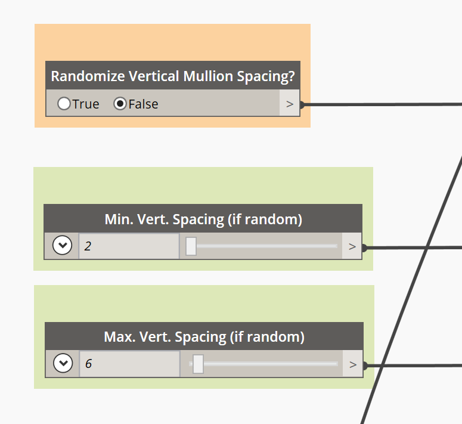

# System szprosów witryny/ściany kurtynowej

## Obsługiwane przez dodatek Dynamo

Możliwość szybkiego tworzenia systemów szprosów witryny/ściany kurtynowej w programie FormIt jest obsługiwana przez dodatek Dynamo. System Storefront Curtainwall można znaleźć w katalogu Dynamo Samples w panelu Dynamo:

## Wybieranie szyby dla systemu szprosów

Od wersji FormIt 2021.2 w systemie Storefront Curtainwall używany jest nowy węzeł [SelectFromFormIt](https://formit.autodesk.com/page/formit-dynamo#dynamo-formit-nodes), który umożliwia wybranie szyby, „glass” (pojedynczej powierzchni lub wyciągniętej bryły), wokół której ma zostać wygenerowany system szprosów.

Po kliknięciu miniatury Storefront Curtainwall (zwróć uwagę na ikonę wskazującą, że wymagany jest wybór) zostanie wyświetlony monit programu FormIt o wybranie geometrii szyby, aby można było kontynuować:

.png>)

Kilka uwag i zastrzeżeń dotyczących sposobu wyboru szyby:

* Obecnie obsługiwane są tylko powierzchnie płaskie. Jeśli zostanie wybrany szereg powierzchni (na przykład powierzchnia „zakrzywiona” składająca się z mniejszych powierzchni płaskich), skrypt znajdzie największą powierzchnię płaską i użyje tej powierzchni.
* Jeśli szyba jest bryłą — tzn. pojedyncza powierzchnia jest wyciągnięta bardzo nieznacznie w celu uzyskania odrobiny grubości — skrypt znajdzie największą powierzchnię i wynikowe szprosy zostaną wygenerowane po jednej stronie bryły szklanej.
* Można naszkicować otwory na drzwi i usunąć wynikową powierzchnię z obwiedni szyby. Wynikowe szprosy będą uwzględniać otwór drzwiowy, pozostawiając puste miejsce na dodanie drzwi.
* Z powodu ograniczeń dodatku Dynamo ten skrypt nie będzie działał, jeśli geometria szyby ma otwory w środku.

## Porady

Podczas wybierania geometrii dla wykresu Dynamo w programie FormIt niektóre rozwiązania organizacyjne mogą uprościć pracę i ułatwić uzyskiwanie wyników:

* Umieść szybę w grupie i użyj opcji Grupa jako wyboru dla skryptu Storefront/Curtainwall. W ten sposób łatwiej jest edytować profil szyby po wygenerowaniu szprosów. Jeśli szyba jest w znacznym stopniu modyfikowana między przebiegami i zmieniają się identyfikatory powierzchni, grupa zapewnia, że skrypt zawsze znajdzie tę szybę, ponieważ używa identyfikatora grupy, a nie identyfikatora powierzchni.
* Jeśli planujesz skopiowanie i wklejenie wyników systemu szprosów w innych miejscach w modelu, najlepiej, aby szyba i wynikowe szprosy były zawarte w grupie. Zapobiegnie to również problemom z ustaleniem w węźle wyboru, które wystąpienie szyby ma być używane podczas kopiowania i wklejania wynikowej grupy szprosów.
   * Najpierw umieść szybę w grupie. Kliknij dwukrotnie szybę, aby ją wybrać, a następnie naciśnij klawisz G lub użyj poleceń grupy w menu kontekstowym lub na pasku narzędzi.
   * Wybierz grupę wynikową i umieść ją w innej grupie.
   * Kliknij dwukrotnie, aby przejść do pierwszej grupy. Jest to „pojemnik” zarówno na szybę, jak i na wynikowe szprosy.
   * Kliknij miniaturę Storefront Curtainwall i użyj grupy szyby jako wyboru.
   * Po uruchomieniu skryptu można zamknąć grupę i skopiować/wkleić pojemnik, w którym się znajduje, jeśli zachodzi taka potrzeba. Bez problemu można edytować dowolne wystąpienia (dopasowując kształt lub parametry szyby).

## Opcje systemu szprosów

Po wybraniu szyby i uruchomieniu skryptu uzyskuje się wynik w obszarze rysunku programu FormIt w postaci grupy programu FormIt. Ta grupa zostanie automatycznie wybrana, a na panelu Właściwości zostaną wyświetlone dostępne opcje.

.png>)

* **Run**: Jeśli zmienisz kształt szyby i zechcesz ponownie uruchomić wykres, aby zaktualizować wyniki szprosów, kliknij tę opcję.
* **Edit Embedded Graph**: Edytuj skrypt Dynamo, który generuje geometrię. Ten skrypt jest osadzony w pliku programu FormIt i jest charakterystyczny dla tej grupy.
* **Select Glass (Surface or Solid)**: kliknij tę opcję, aby zaktualizować wybór do innej szyby, wokół której mają być generowane szprosy.

Skrypt będzie używał wartości domyślnych dla pierwszego przebiegu, dlatego należy dostosować je do danego konkretnego przypadku zastosowania. We wszystkich wartościach będą używane jednostki określone przez węzeł [FormItLengthString](https://formit.autodesk.com/page/formit-dynamo/#dynamo-formit-nodes).

* **Mullion Width + Depth**: Szerokość i głębokość wszystkich elementów szprosu.
* **Vertical Mullion Spacing**: Odległość między środkami poszczególnych szprosów pionowych.
* **Flip Vertical Mullion Layout**: Skrypt rozpoczyna odstępy między szprosami pionowymi z jednej dowolnie wybranej strony. Jeśli w wyniku tej operacji odstępy między szprosami rozpoczynają się po niewłaściwej dla danego zastosowania stronie, ustaw wartość True, aby odwrócić ten układ.
* **Center Vertical mullion Layout**: Zamiast rozpoczynać obliczenia odstępów między szprosami pionowymi na jednym końcu szyby, rozpocznij obliczenia od środka, tworząc symetryczny układ szprosów pionowych.
* **First Horizontal Mullion Spacing**: Umożliwia ustawienie odstępu pierwszego szprosu poziomego od dołu. Jest to przydatna opcja, jeśli na dole potrzebny jest rząd krótszych modułów przeszklenia, niezależnie od pozostałych rozstawów szprosów poziomych.
* **Horizontal Mullion Spacing**: Typowy odstęp między środkami szprosów poziomych, od pierwszego szprosu, jak wyjaśniono powyżej.
* **Flip Horizontal Mullion Layout**: Jeśli układ szprosów poziomych ma rozpoczynać się u góry, a nie u dołu, ustaw wartość True.
* **Center Horizontal Mullion Layout**: Zamiast rozpoczynać obliczenia odstępów między szprosami poziomymi u dołu lub u góry szyby, rozpocznij obliczenia od środka, tworząc symetryczny układ szprosów poziomych.

## Opcje ukryte

Szukasz dodatkowych możliwości dostosowania? W panelu właściwości programu FormIt jest ukrytych kilka zaawansowanych opcji, ale są one dostępne po kliknięciu przycisku „Edit Embedded Graph” w celu wyświetlenia całej zawartości wykresu w dodatku Dynamo:

### Szprosy losowe

* **Randomize Vertical and Horizontal Mullion Layout**: Ustaw wartość True, aby losowo rozmieścić szprosy pionowe lub poziome.
* **Min/Max Mullion Spacing (if random)**: te wartości można dostosować, aby ustawić zakres minimalnych i maksymalnych losowych wartości odstępów.

### Szprosy graniczne

* **Flip Offset Direction of Border Mullions:** Domyślnie system szprosów będzie używał obwiedni szyby i odsunie ją do wewnątrz, aby utworzyć szprosy graniczne. Aby odsunąć ją na zewnątrz, ustaw tę opcję na True. Spowoduje to rozszerzenie całkowitego rozmiaru systemu szprosów poza obwiednię szyby o wartość szerokości szprosu.
* **Tolerance Between Selection and Border Mullions**: Domyślnie system szprosów będzie generowany dokładnie na granicy szyby, co może spowodować niedopasowanie brzegu szyby i zewnętrznych powierzchni szprosów granicznych. W większości przypadków nie będzie to widoczne, ale jeśli w danym zastosowaniu wymagana jest widoczność krawędzi systemu i chcesz uniknąć niedopasowania, włącz tę opcję i dostosuj wartość tolerancji zgodnie z potrzebami.
