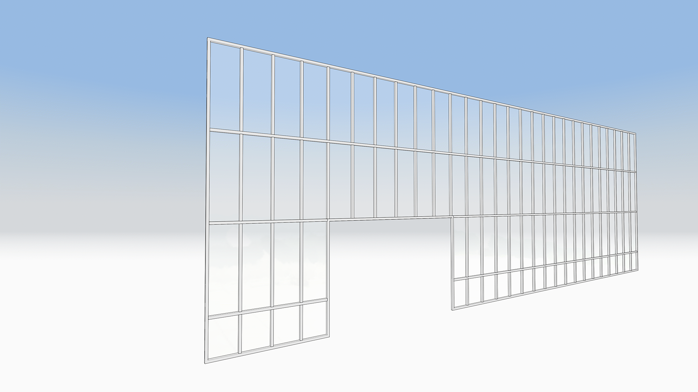

# Система импостов витрины/витража

## Технологии Dynamo

В FormIt реализована возможность быстрого создания импостов витрин и витражей на платформе Dynamo. Система витража витрины (Storefront Curtainwall) размещена в каталоге примеров Dynamo на панели Dynamo:

## Выбор объекта в качестве «стекла» для системы импостов

Начиная с версии FormIt 2021.2, в системе витража витрины используется новый [узел SelectFromFormIt](https://formit.autodesk.com/page/formit-dynamo#dynamo-formit-nodes), позволяющий выбрать фрагмент «стекла» (одну грань или выдавленное твердое тело) для создания вокруг него системы импостов.

По щелчку миниатюры витража витрины (обратите внимание на значок, указывающий на необходимость выбора) FormIt предложит выбрать стеклянный объект геометрии.

.png>)

Некоторые примечания по выбору стекла.

* В настоящее время поддерживаются только плоские поверхности. Если выбрать ряд поверхностей (например, криволинейную поверхность, состоящую из небольших плоских поверхностей), в ходе выполнения сценария будет выбрана и использована самая большая плоская грань.
* Если стекло является твердым телом, то есть представляет собой единую грань, слегка выдавленную для создания эффекта толщины, в ходе выполнения сценария будет найдена самая большая поверхность, поэтому полученные импосты будут созданы с одной стороны стеклянного тела.
* Можно построить эскиз дверных проемов и удалить полученную поверхность с границы стекла, при этом в полученных импостах будет учтен дверной проем, оставленный пустым для добавления дверей.
* Из-за ограничений Dynamo данный сценарий не будет выполнен, если в центре геометрии остекления имеются проемы.

## Советы и рекомендации

При выборе объектов геометрии для графика Dynamo в FormIt следующие рекомендации по упорядочению помогут упростить работу и создание экземпляров.

* Поместите стекло в группу и выберите ее для сценария «Витрина/витраж». Это упрощает редактирование профиля остекления после создания импостов. При сильном изменении остекления и изменении идентификаторов граней применение группы гарантирует, что в ходе сценария будет найдено остекление, поскольку используется идентификатор группы, а не идентификатор грани.
* Если вы планируете копировать и вставлять результаты системы импостов в другие места модели, в группе должно быть стекло и полученные импосты. Это также позволит избежать проблем, связанных с узлом выбора, когда неизвестно, какой экземпляр остекления следует использовать при копировании и вставке полученной группы импостов.
   * Сначала добавьте в группу стекло. Дважды щелкните стекло, чтобы выбрать его, и нажмите G или используйте команды группы в контекстном меню или на панели инструментов.
   * Выберите полученную группу и поместите ее в другую группу.
   * Дважды щелкните, чтобы начать работу с первой группой. Она служит «контейнером» для стекла и для полученных импостов.
   * Щелкните миниатюру витража витрины и выберите группу «Стекло».
   * После выполнения сценария можно завершить работу с группой и при необходимости скопировать/вставить контейнер. Можно без проблем отредактировать любой из экземпляров (скорректировать форму или параметры стекла).

## Параметры системы импостов

После выбора стекла и выполнения сценария результат будет представлен в активном окне FormIt в виде группы FormIt. Эта группа будет выбрана автоматически, а на панели свойств появятся доступные параметры.

.png>)

* **Run** (выполнить): если при изменении формы стекла требуется повторно запустить график для обновления результатов импостов, щелкните этот значок.
* **Edit Embedded Graph** (редактировать встроенный график): редактирование сценария Dynamo, создающего объекты геометрии. Этот сценарий встроен в файл FormIt и относится только к данной группе.
* **Select Glass (Surface or Solid)** (выбрать стекло (поверхность или тело)): щелкните этот параметр, чтобы обновить набор объектов с учетом другого фрагмента стекла, вокруг которого необходимо создать импосты.

При первом выполнении сценария будут использоваться значения по умолчанию, поэтому их необходимо настроить в соответствии с вашим вариантом использования. Для всех значений будут использоваться единицы, заданные узлом [FormItLengthString](https://formit.autodesk.com/page/formit-dynamo/#dynamo-formit-nodes).

* **Mullion Width + Depth**: ширина и глубина всех элементов импостов.
* **Vertical Mullion Spacing**: расстояние по центру между вертикальными импостами.
* **Flip Vertical Mullion Layout**: в ходе сценария интервал между вертикальными импостами рассчитывается с одной стороны, выбираемой произвольным образом. Если в результате интервал между импостами начинается с неправильной для данного варианта стороны, установите для этого параметра значение «True», чтобы зеркально отобразить компоновку и начать интервал с противоположной стороны.
* **Center Vertical Mullion Layout**: расчет вертикального интервала начнется с середины (а не с одного из краев стекла) для создания симметричной компоновки вертикальных импостов.
* **First Horizontal Mullion Spacing**: задает интервал первого горизонтального импоста снизу. Параметр используется, если в нижней части необходим ряд модулей остекления меньшего размера, отделенный от остальных горизонтальных импостов.
* **Horizontal Mullion Spacing**: расстояние по центру между горизонтальными импостами, начинающееся от первого импоста, как описано выше.
* **Flip Horizontal Mullion Layout**: если необходимо, чтобы компоновка горизонтальных импостов начиналась сверху, а не снизу, задайте для этого параметра значение «True».
* **Center Horizontal Mullion Layout**: расчет горизонтального интервала начнется с середины (а не сверху или снизу стекла) для создания симметричной компоновки горизонтальных импостов.

## Скрытые параметры

Ищете дополнительные возможности работы с образцами? Некоторые дополнительные параметры на панели свойств FormIt скрыты, однако их можно открыть, щелкнув «Edit Embedded Graph» (редактировать встроенный график), чтобы отобразить все графическое содержимое Dynamo:

### Randomized Mullions (импосты в случайном порядке)

* **Randomize Vertical and Horizontal Mullion Layout**: если установлено значение «True», вертикальные или горизонтальные импосты будут размещены в случайным порядке.
* **Min/Max Mullion Spacing (if random)**: данные значения позволяют задать минимальное и максимальное значения интервала при размещении в случайном порядке.

### Border Mullions (крайние импосты)

* **Flip Offset Direction of Border Mullions:** по умолчанию в системе импостов используется граница остекления, и для создания крайних импостов выполняется смещение внутрь. Для смещения наружу установите для этого параметра значение «True». Это приведет к увеличению общего размера системы импостов за пределы границы остекления на величину, заданную параметром «Mullion Width» (ширина импоста).
* **Tolerance Between Selection and Border Mullions**: по умолчанию система импостов формируется точно на границе остекления, что может привести к возникновению Z-конфликтов в местах пересечения кромки стекла и наружных поверхностей крайних импостов. Зачастую это незаметно, однако если в данном варианте использования ребра системы должны быть видимыми и во избежание возникновения Z-конфликтов, включите этот параметр и при необходимости скорректируйте значение допуска.
