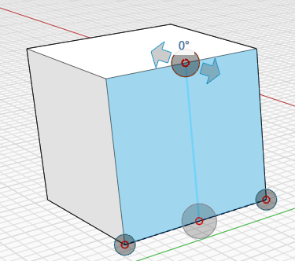
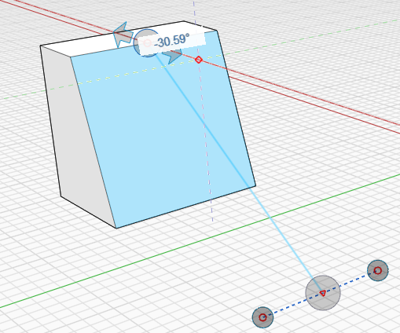

# Powierzchnie: pochylanie i spłaszczanie/wygładzanie

## Praca z powierzchniami: pochylanie i spłaszczanie/wygładzanie

Aby tworzyć bardziej złożone projekty po naszkicowaniu kształtu lub umieszczeniu prymitywu, można modyfikować geometrię za pomocą kilku narzędzi kontekstowych. Te operacje obejmują polecenia Pochyl, Szyk oraz Kopiuj i Wklej.

### Pochylanie powierzchni

**Pochylanie powierzchni:**

1. Wybierz powierzchnię i kliknij prawym przyciskiem myszy, aby wyświetlić menu kontekstowe.&#x20;
2. Wybierz ikonę **Pochyl** z menu kontekstowego.
3. Zdefiniuj oś pochylenia, rysując linię.&#x20;
4. Kliknij trzeci punkt, aby rozpocząć operację pochylania.

.png>)\
\

### Spłaszczanie/wygładzanie powierzchni

Jeśli po umieszczeniu kursora na powierzchni pojawiają się linie kropkowane, oznacza to, że dana powierzchnia składa się z mniejszych powierzchni, ponieważ jest zdeformowana. **Przekształcanie linii kropkowanych w krawędzie modelu:**

1. Wybierz powierzchnię lub obiekt, który chcesz zmienić, a następnie kliknij prawym przyciskiem myszy, aby wyświetlić menu kontekstowe.&#x20;
2. Z menu kontekstowego wybierz narzędzie **Powierzchnie wygładzone płaszczyzną**.&#x20;
3. W miejscu, w którym powierzchnia była wcześniej gładka, zostaną automatycznie dodane krawędzie.&#x20;

To polecenie działa też w odwrotny sposób: można również wybrać powierzchnie mające wiele płaszczyzn i wybrać narzędzie **Powierzchnie wygładzone płaszczyzną** z menu kontekstowego, aby ukryć krawędzie i wygładzić powierzchnie.

\

